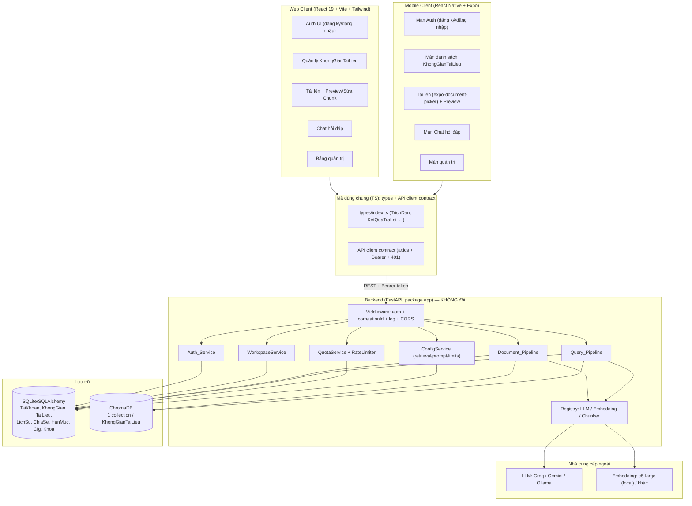
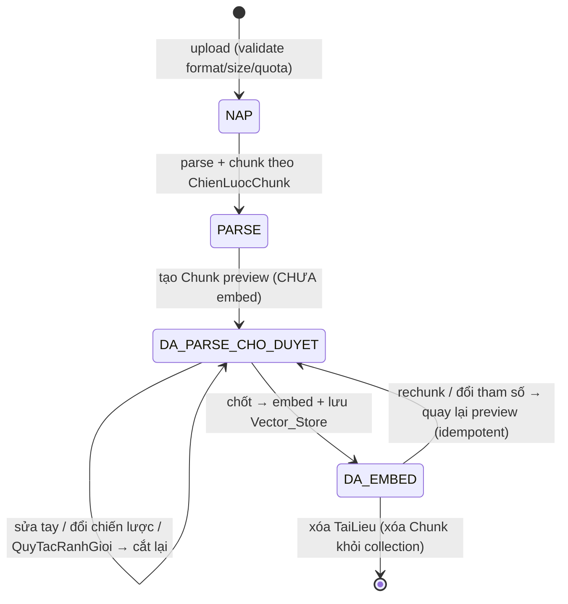
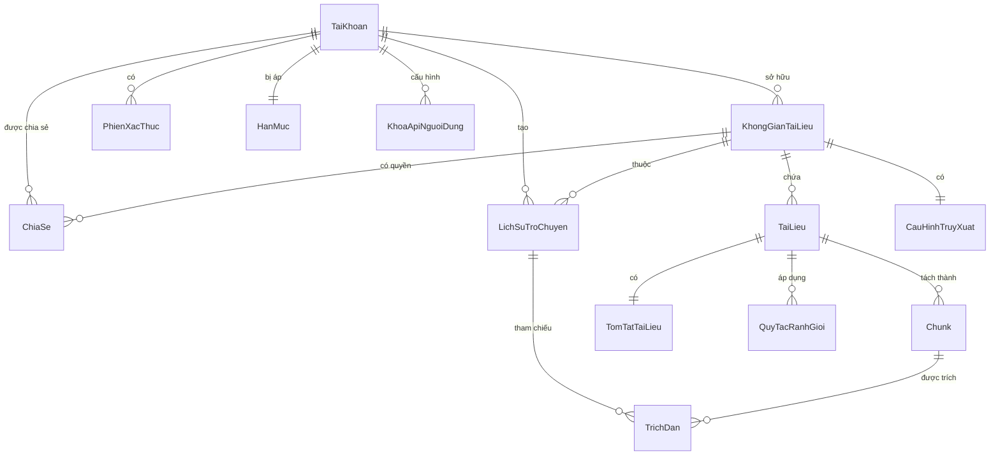

# Design Document — Multi-User RAG Platform

## Overview

Tài liệu này mô tả thiết kế kỹ thuật cho việc tổng quát hóa hệ thống **Vietnam Law RAG** hiện có thành một **nền tảng RAG đa người dùng, đa lĩnh vực**. Thiết kế kế thừa kiến trúc đã có (FastAPI + package `app`, React 19 + Vite + Tailwind v4, ChromaDB, embedding e5-large local, registry tự-đăng-ký provider, logging tập trung) và mở rộng theo bốn trục lớn:

1. **Đa người dùng có xác thực thật**: thay token HMAC single-admin bằng đăng ký/đăng nhập đầy đủ, băm mật khẩu, khóa đăng nhập tạm thời, thu hồi phiên, vai trò NGUOI_DUNG/QUAN_TRI (R1, R2, R10, R25).
2. **Cô lập dữ liệu theo người dùng + không gian tài liệu**: mọi TaiLieu, Chunk, LichSuTroChuyen, cấu hình đều thuộc về một KhongGianTaiLieu có chủ sở hữu; truy xuất vector luôn bị giới hạn theo quyền (R3, R4, R5, R6, R11).
3. **Tổng quát hóa khỏi lĩnh vực luật**: bỏ manifest cố định, gợi ý sinh từ tài liệu thực; chunking đa chiến lược qua registry với chế độ "Tự động"; cấu hình truy xuất, prompt, embedding, chunk đều chỉnh được trong ứng dụng (R13, R15, R16, R17, R18, R19, R20, R21).
4. **Vận hành an toàn, cấu hình được**: BYOK mã hóa khóa, hạn mức tài nguyên nguyên tử, giới hạn tần suất, timeout/giới hạn cấu hình được, logging tập trung che dữ liệu nhạy cảm (R12, R14, R22, R23, R24).

### Ba tầng hệ thống: Backend + Web + Mobile

Nền tảng được tổ chức thành **ba tầng** chạy song song, dùng chung một backend:

1. **Backend (FastAPI, package `app`)** — nguồn sự thật duy nhất cho logic nghiệp vụ, dữ liệu và RAG; phục vụ mọi client qua **REST API** sẵn có. Tầng này **về cơ bản không đổi** vì đã phục vụ client qua REST (xác thực Bearer token, JSON DTO, multipart upload).
2. **Web (React 19 + Vite + Tailwind v4)** — client web hiện có, **giữ nguyên**, tiếp tục chạy như trước.
3. **Mobile (React Native + Expo)** — client di động **mới**, chạy song song với Web, gọi **cùng** REST API của backend.

Web và Mobile là hai client ngang hàng, **không** client nào là proxy của client kia; cả hai cùng tiêu thụ một hợp đồng API. Mục tiêu là **tái sử dụng tối đa** phần logic không phụ thuộc nền tảng (kiểu dữ liệu TypeScript, hợp đồng API client, xử lý 401, logic auth/query/document) giữa Web và Mobile, chỉ tách riêng phần đặc thù thiết bị (điều hướng, màn hình, lưu token an toàn trên máy, chọn tệp từ thiết bị). Chi tiết xem mục **Kiến trúc ứng dụng Mobile** và **Chiến lược chia sẻ mã giữa Web và Mobile**.

### Nguyên tắc thiết kế kế thừa

- **Đặt tên**: entity/field tiếng Việt không dấu (`taiKhoan`, `khongGianId`, `soChunk`); verb/method tiếng Anh (`createWorkspace`, `verifyToken`, `rechunkDocument`); UI label tiếng Việt có dấu.
- **Registry tự-đăng-ký**: chunking strategy và embedding provider tuân theo đúng pattern của LLM provider hiện có (`@register_*` + auto-discover `*_provider.py` / `*_chunker.py`, không sửa factory/core khi thêm mới).
- **Logging tập trung**: tiếp tục dùng một `setup_logging()` duy nhất; mọi thành phần mới ghi log qua logger chung, che trường nhạy cảm.
- **Strict grounding**: prompt tổng hợp duy nhất, trung lập lĩnh vực, không bịa nội dung; trích dẫn `[n]`; xác minh chéo bất đồng bộ; fallback chunk gốc khi LLM lỗi.

### Quyết định kiến trúc chính (và lý do)

| Quyết định | Lựa chọn | Lý do |
|---|---|---|
| Kho dữ liệu quan hệ | **SQLite + SQLAlchemy** | Hệ thống đã dùng SQLite (ChromaDB metadata); nhẹ, không thêm hạ tầng; đủ cho tài khoản/không gian/lịch sử/cấu hình. Có thể đổi sang Postgres qua connection string mà không đổi mô hình. |
| Phân vùng vector | **1 ChromaDB collection cho mỗi KhongGianTaiLieu** | Cô lập dữ liệu ở tầng lưu trữ (R3.4), cho phép mỗi không gian có Embedding_Provider riêng (R21), xóa không gian = xóa collection. |
| Xác thực | **Token HMAC có hạn + bảng PhienXacThuc để thu hồi** | Kế thừa cơ chế HMAC sẵn có nhưng bổ sung thu hồi (logout, đổi mật khẩu, vô hiệu hóa tài khoản) mà chỉ kiểm tra trạng thái phiên — R2.8/9, R10.8, R25.1. |
| Vòng đời tài liệu | **Máy trạng thái NAP → PARSE → DA_PARSE_CHO_DUYET → CHOT → DA_EMBED** | Tách bước parse/chunk khỏi embed để hỗ trợ xem trước và sửa chunk trước khi tốn chi phí embedding (R5.13, R18). |
| Mã hóa khóa API | **Fernet (AES-128) với khóa hệ thống** | Mã hóa-at-rest đối xứng, round-trip xác định, không lưu plaintext (R22.2). |

### Sơ đồ ngữ cảnh



## Architecture

### Phân tầng

Hệ thống giữ nguyên phân tầng của codebase hiện có và mở rộng từng tầng:

```
app/
├── main.py                  # FastAPI app, lifespan/DI, CORS, middleware, mount routers + frontend dist
├── config.py                # Settings (pydantic-settings) — bổ sung secret_key mã hóa, default quotas, limits
├── logging_config.py        # setup_logging() — giữ nguyên, thêm correlationId filter
├── db/
│   ├── database.py          # SQLAlchemy engine/session, init_db()
│   └── models.py            # ORM: TaiKhoan, PhienXacThuc, KhongGianTaiLieu, ChiaSe, TaiLieu,
│                            #      Chunk, TomTatTaiLieu, QuyTacRanhGioi, CauHinhTruyXuat,
│                            #      MauPrompt, KhoaApiNguoiDung, HanMuc, LichSuTroChuyen
├── auth/
│   ├── auth_service.py      # register/login/logout/verify/refresh/change/reset password
│   ├── password.py          # hash/verify (bcrypt), validate độ dài
│   ├── tokens.py            # create/verify HMAC token (kế thừa api/auth.py), gắn jti → PhienXacThuc
│   └── crypto.py            # encrypt/decrypt KhoaApiNguoiDung (Fernet)
├── api/
│   ├── dependencies.py      # DI: get_db, get_current_user, require_role, require_workspace_access
│   ├── middleware/
│   │   ├── error_handler.py # giữ nguyên: 400 validation / 4xx domain / 500 + correlationId
│   │   ├── correlation.py   # sinh/đính correlationId vào request + log context
│   │   └── rate_limit.py    # RateLimiter theo TaiKhoan (R24)
│   └── routes/
│       ├── auth.py          # /api/auth/* (register, login, logout, refresh, password)
│       ├── workspaces.py    # /api/workspaces CRUD + share + config
│       ├── documents.py     # /api/workspaces/{id}/documents upload/list/delete/preview/rechunk/edit
│       ├── query.py         # /api/workspaces/{id}/query
│       ├── history.py       # /api/workspaces/{id}/history
│       └── admin.py         # /api/admin/* (users, quotas, prompts, limits)
├── services/
│   ├── workspace_service.py # createWorkspace/rename/updateDescription/delete (transactional)
│   ├── share_service.py     # grantShare/revokeShare + resolveAccess
│   ├── quota_service.py     # checkAndReserve (atomic), releaseQuota
│   ├── config_service.py    # retrieval config / prompt template / operational limits CRUD + reset
│   └── history_service.py   # saveTurn/listHistory/deleteTurn/markStaleCitations
├── pipelines/
│   ├── document_pipeline.py # parse → chunk → preview → (chốt) embed → store; rechunk idempotent
│   └── query_pipeline.py    # intent-classify → normalize → hybrid search → gating → synthesis
│                            #      → verify(async) → fallback; overview mode dùng TomTatTaiLieu
├── chunking/
│   ├── registry.py          # @register_chunker + auto-discover *_chunker.py
│   ├── auto_selector.py     # chọn chiến lược theo thứ tự ưu tiên cố định (R17)
│   ├── recursive_chunker.py
│   ├── structure_chunker.py # markdown/structure-aware
│   ├── page_chunker.py
│   ├── semantic_chunker.py
│   └── vietnamese_law_chunker.py  # kế thừa, đăng ký tên "vietnamese-law"
├── providers/               # kế thừa: registry LLM + embedding (auto-discover *_provider.py)
├── prompts/
│   └── system_prompts.py    # default templates + INVARIANT_SAFETY_CONSTRAINTS (bất biến)
└── models/schemas.py        # Pydantic request/response DTO
```

### Luồng xử lý truy vấn (mở rộng từ QueryPipeline hiện có)

```mermaid
flowchart TD
    A[POST /workspaces/id/query + token] --> B{Xác thực + quyền không gian}
    B -->|401/403/404| Z[Trả lỗi tương ứng]
    B -->|OK| C{Rate limit?}
    C -->|vượt| Z2[429, không gọi LLM]
    C -->|OK| D[Validate câu hỏi 1..1000]
    D --> E{Phân loại ý định\ntổng quan vs chi tiết\n(xác định) hoặc ép chế độ}
    E -->|tổng quan| OV[Tổng hợp từ TomTatTaiLieu + outline\ncác TaiLieu có quyền]
    E -->|chi tiết| F[Chuẩn hóa câu hỏi không dấu\n+ guard cùng bộ từ]
    F --> G[Embed + Hybrid search RRF\ngiới hạn collection của không gian\nk + trọng số từ CauHinhTruyXuat]
    G --> H{Lọc ngưỡng}
    H -->|< nguongKhongTimThay| I[Trả 'không tìm thấy'\nKHÔNG gọi LLM]
    H -->|< nguongDuLienQuan| J[Trả 'chưa đủ liên quan'\nKHÔNG gọi LLM]
    H -->|đủ| K[Tổng hợp Groq: chèn n inline]
    K -->|lỗi/timeout| L[Fallback: trả chunk gốc]
    K -->|OK| M[Trả câu trả lời + TrichDan]
    OV --> M
    M --> N[Lưu LichSuTroChuyen của TaiKhoan]
    M --> V[Xác minh chéo BẤT ĐỒNG BỘ\nnhãn: đã xác minh / có mâu thuẫn / chưa xác minh]
```

### Luồng vòng đời tài liệu (máy trạng thái)



Trạng thái được giữ trong bảng `TaiLieu.trangThai`. **Bất biến cốt lõi**: vector chỉ tồn tại trong Vector_Store khi và chỉ khi `trangThai = DA_EMBED` (R5.13). Mọi thao tác cắt lại đều xóa sạch Chunk cũ của đúng TaiLieu đó trước khi ghi Chunk mới (idempotent — R5.12, R18.7, R21.4).

### Mô hình ủy quyền (resolveAccess)

Một hàm trung tâm `resolveAccess(taiKhoan, khongGian) -> {NONE, CHI_DOC, GHI, CHU_SO_HUU}` quyết định mọi quyền:

- Chủ sở hữu → `CHU_SO_HUU` (đầy đủ quyền, gồm chia sẻ/xóa không gian).
- WHERE chia sẻ bật và có bản ghi ChiaSe → trả `mucQuyen` tương ứng (CHI_DOC | GHI).
- Ngược lại → `NONE` (mọi thao tác bị 403/404).

Thao tác ghi (upload, xóa TaiLieu, sửa chunk, chỉnh CauHinhTruyXuat) yêu cầu `GHI` hoặc `CHU_SO_HUU`. Đọc/truy vấn yêu cầu tối thiểu `CHI_DOC`. Đổi tên/mô tả/xóa không gian và chia sẻ/thu hồi chỉ `CHU_SO_HUU`.

## Components and Interfaces

Các interface dưới đây mô tả hợp đồng (contract) ở mức hành vi. Tên method dùng động từ tiếng Anh; tham số/field dùng danh từ tiếng Việt không dấu, đúng quy ước dự án.

### Auth_Service

```python
class AuthService:
    def register(self, email: str, tenDangNhap: str, matKhau: str) -> TaiKhoan: ...
        # R1: validate email (<=254, đúng định dạng), tenDangNhap (3-30), matKhau (8-64);
        # băm mật khẩu (bcrypt); VaiTro mặc định NGUOI_DUNG; lỗi trùng nêu rõ trường.

    def login(self, tenDangNhap: str, matKhau: str) -> tuple[str, VaiTro]: ...
        # R2.1-4, R10.7: kiểm tra lockout (5 fail/15p), tài khoản VO_HIEU_HOA → từ chối;
        # thành công → tạo PhienXacThuc (hạn = sessionTtl cấu hình) + token; lỗi chung không lộ trường.

    def verifyToken(self, token: str) -> TaiKhoan: ...
        # R2.5-7,9; R10.8: HMAC hợp lệ + còn hạn + PhienXacThuc chưa revoke + tài khoản HOAT_DONG.

    def logout(self, jti: str) -> None: ...            # R2.8: đặt revokedAt cho phiên hiện tại
    def refreshSession(self, token: str) -> str: ...   # R25.5: cấp token mới trong giới hạn an toàn
    def changePassword(self, taiKhoan, matKhauCu, matKhauMoi) -> None: ...  # R25.1: revoke phiên khác
    def requestPasswordReset(self, email: str) -> None: ...  # R25.2-3: phản hồi chung chung
    def resetPassword(self, tokenReset: str, matKhauMoi: str) -> None: ...  # R25.4: single-use + hết hạn
```

### WorkspaceService / ShareService

```python
class WorkspaceService:
    def createWorkspace(self, chuSoHuu, ten: str, moTa: str = "") -> KhongGianTaiLieu: ...
        # R4.1-2, R12.1: trim ten 1-100; kiểm HanMuc số không gian (atomic) trước khi tạo.
    def renameWorkspace(self, taiKhoan, khongGianId, tenMoi: str) -> KhongGianTaiLieu: ...  # R4.3,5
    def updateDescription(self, taiKhoan, khongGianId, moTa: str) -> KhongGianTaiLieu: ...  # R4.4 (<=1000)
    def deleteWorkspace(self, taiKhoan, khongGianId) -> None: ...
        # R4.6-8: transaction — xóa Chunk(collection) + TaiLieu + TrichDan, đánh dấu LichSu;
        # rollback nếu thất bại giữa chừng.

class ShareService:  # R11 (WHERE chia sẻ bật)
    def grantShare(self, chuSoHuu, khongGianId, taiKhoanMucTieuId, mucQuyen: MucQuyen) -> ChiaSe: ...
        # mucQuyen ∈ {CHI_DOC, GHI}; ngoài tập → 400; tài khoản đích không tồn tại → 404.
    def revokeShare(self, chuSoHuu, khongGianId, taiKhoanMucTieuId) -> None: ...  # sau đó truy cập → 403
    def resolveAccess(self, taiKhoan, khongGian) -> MucTruyCap: ...
```

### Document_Pipeline

```python
class DocumentPipeline:
    def uploadDocument(self, taiKhoan, khongGian, file, chienLuocChunk="auto") -> PreviewResult: ...
        # R5.1-5, R12.2-3: validate quyền GHI, định dạng, kích thước (limit cấu hình), quota dung lượng
        # + số tài liệu (atomic); parse → chunk; 0 chunk → từ chối; KHÔNG embed; trạng thái
        # DA_PARSE_CHO_DUYET; trả soChunk + danh sách Chunk preview.

    def previewChunks(self, taiKhoan, taiLieuId) -> list[ChunkPreview]: ...  # R18.1
    def editChunks(self, taiKhoan, taiLieuId, ops: list[ChunkEditOp]) -> list[ChunkPreview]: ...
        # R18.3,11: merge/split/điều chỉnh ranh giới; Chunk rỗng → từ chối, giữ nguyên.
    def setBoundaryRules(self, taiKhoan, phamVi, rules: list[QuyTacRanhGioi]) -> None: ...  # R18.4
    def commitEmbedding(self, taiKhoan, taiLieuId) -> IndexingResult: ...
        # R5.13: chốt → embed (Embedding_Provider của không gian) → lưu collection; → DA_EMBED.
    def rechunk(self, taiKhoan, taiLieuId, chienLuocChunk=None, thamSo=None) -> PreviewResult: ...
        # R5.12, R18.7, R21.4: cắt lại idempotent, xóa sạch Chunk cũ; lỗi → giữ Chunk cũ (R18.10).
    def resetToDefault(self, taiKhoan, taiLieuId | khongGianId) -> PreviewResult: ...  # R18.6
    def deleteDocument(self, taiKhoan, taiLieuId) -> None: ...  # R5.8-9
    def buildSummary(self, taiLieu) -> TomTatTaiLieu: ...  # R5.10: tóm tắt + outline
    def listDocuments(self, taiKhoan, khongGianId, page=1, pageSize=20) -> PaginatedDocumentResponse: ...  # R5.7
```

### Chunking registry + auto selector

```python
@register_chunker("recursive" | "structure-aware" | "page" | "semantic" | "vietnamese-law")
class SomeChunker(ChunkerBase):
    def chunk(self, text: str, thamSo: ChunkParams, rules: list[QuyTacRanhGioi]) -> list[Chunk]: ...

class AutoSelector:  # R17.3-8 — thứ tự ưu tiên CỐ ĐỊNH
    PRIORITY = ["vietnamese-law", "structure-aware", "page", "recursive"]
    def selectStrategy(self, taiLieu, tomTat=None) -> str: ...
        # 1) có 'Điều' + chữ số đầu dòng → vietnamese-law (bất kể dấu hiệu khác)
        # 2) không (1) nhưng có heading markdown → structure-aware
        # 3) không (1)(2), là PDF phân trang → page
        # 4) còn lại → recursive
```

### Query_Pipeline

```python
class QueryPipeline:
    def process_query(self, taiKhoan, khongGian, cauHoi: str, cheDo: str | None = None) -> KetQuaTraLoi: ...
        # cheDo ∈ {None(auto), "tong-quan", "chi-tiet"} (R16.6-8)
    def classifyIntent(self, cauHoi: str) -> str: ...  # R16.6 — xác định: cùng input → cùng output
    def normalizeQuestion(self, cauHoi: str) -> str: ...  # R6.7 — guard cùng bộ từ sau bỏ dấu
    def retrieve(self, khongGian, cauHoi, cfg: CauHinhTruyXuat) -> list[Chunk]: ...
        # R3.4, R6.1,4: hybrid RRF, chỉ collection của không gian, k + trọng số từ cfg
    def synthesize(self, cauHoi, chunks, mauPrompt) -> str: ...  # R7: chèn [n], strict grounding
    def verifyAnswer(self, traLoi, chunks) -> NhanXacMinh: ...  # R8.1 — async, 1 trong 3 nhãn
    def answerOverview(self, khongGian, taiKhoan, cauHoi) -> KetQuaTraLoi: ...  # R16.1-2
```

### Cấu hình & quản trị

```python
class ConfigService:
    def updateRetrievalConfig(self, taiKhoan, khongGianId, cfg: CauHinhTruyXuatInput) -> CauHinhTruyXuat: ...
        # R19: ngưỡng ∈ [0,1], duoi<=tren, k hợp lệ, trọng số hợp lệ; ngoài range → từ chối; cần GHI.
    def resetRetrievalConfig(self, taiKhoan, khongGianId) -> CauHinhTruyXuat: ...  # R19.3
    def updatePromptTemplate(self, admin, vaiTro, noiDung) -> MauPrompt: ...
        # R20: chỉ QUAN_TRI; áp INVARIANT_SAFETY_CONSTRAINTS không ghi đè được.
    def resetPromptTemplate(self, admin, vaiTro) -> MauPrompt: ...  # R20.2
    def updateOperationalLimits(self, admin, limits: LimitsInput) -> Limits: ...
        # R23: llm_timeout, sessionTtl, maxFileSize trong range; áp dụng runtime không sửa mã.

class QuotaService:  # R12 — kiểm tra + áp đặt NGUYÊN TỬ
    def checkAndReserve(self, taiKhoanId, loai: LoaiTaiNguyen, luong: int) -> None: ...  # khóa giao dịch
    def releaseQuota(self, taiKhoanId, loai, luong) -> None: ...
    def setQuota(self, admin, taiKhoanId, hanMuc: HanMucInput) -> HanMuc: ...  # R12.5-6 range

class AdminService:  # R10
    def listAccounts(self, admin) -> list[TaiKhoanInfo]: ...
    def disableAccount(self, admin, taiKhoanId) -> None: ...  # R10.2,4 không tự vô hiệu mình; revoke phiên
    def enableAccount(self, admin, taiKhoanId) -> None: ...

class ApiKeyService:  # R22 — BYOK
    def setApiKey(self, taiKhoan, providerTen, vaiTro, khoa) -> None: ...  # mã hóa Fernet
    def getApiKey(self, taiKhoan, providerTen, vaiTro) -> str | None: ...  # giải mã, dùng nội bộ
    def getMaskedKeys(self, taiKhoan) -> list[KhoaApiMasked]: ...  # R22.3 chỉ hiển thị masked
    def deleteApiKey(self, taiKhoan, providerTen, vaiTro) -> None: ...
```

### API endpoints (REST)

| Method & Path | Quyền | Mô tả |
|---|---|---|
| `POST /api/auth/register` | công khai | R1 đăng ký |
| `POST /api/auth/login` | công khai | R2.1 → `{token, vaiTro}` |
| `POST /api/auth/logout` | đã xác thực | R2.8 |
| `POST /api/auth/refresh` | đã xác thực | R25.5 |
| `POST /api/auth/password/change` | đã xác thực | R25.1 |
| `POST /api/auth/password/reset-request` | công khai | R25.2-3 |
| `POST /api/auth/password/reset` | công khai (token reset) | R25.4 |
| `DELETE /api/account` | đã xác thực | R25.6 tự xóa tài khoản |
| `GET/POST /api/workspaces` | đã xác thực | R4.1, R3.1 (chỉ sở hữu + chia sẻ) |
| `PATCH/DELETE /api/workspaces/{id}` | chủ sở hữu | R4.3-8 |
| `POST/DELETE /api/workspaces/{id}/shares` | chủ sở hữu | R11 |
| `GET/PUT /api/workspaces/{id}/retrieval-config` | GHI để sửa | R19 |
| `POST /api/workspaces/{id}/documents` | GHI | R5.1 upload (preview) |
| `GET /api/workspaces/{id}/documents` | CHI_DOC | R5.7 phân trang |
| `GET/PUT /api/documents/{id}/chunks` | GHI | R18.1,3 preview/sửa |
| `POST /api/documents/{id}/commit` | GHI | R5.13 chốt embed |
| `POST /api/documents/{id}/rechunk` | GHI | R5.12, R18.7 |
| `POST /api/documents/{id}/reset` | GHI | R18.6 |
| `DELETE /api/documents/{id}` | GHI | R5.8 |
| `POST /api/workspaces/{id}/query` | CHI_DOC | R6, R16 |
| `GET /api/workspaces/{id}/history` | CHI_DOC (của chính mình) | R9.3 |
| `DELETE /api/history/{id}` | chủ mục | R9.6-7 |
| `GET/POST /api/admin/users`, `/admin/users/{id}/disable\|enable` | QUAN_TRI | R10 |
| `PUT /api/admin/users/{id}/quota` | QUAN_TRI | R12.5 |
| `GET/PUT /api/admin/prompts/{vaiTro}` | QUAN_TRI | R20 |
| `PUT /api/admin/limits` | QUAN_TRI | R23 |
| `GET/PUT/DELETE /api/account/api-keys` | đã xác thực | R22 BYOK |

## Data Models

### Sơ đồ quan hệ



### Định nghĩa thực thể (SQLAlchemy ORM, field tiếng Việt không dấu)

```python
class VaiTro(str, Enum):      NGUOI_DUNG = "NGUOI_DUNG"; QUAN_TRI = "QUAN_TRI"
class TrangThaiTaiKhoan(str, Enum): HOAT_DONG = "HOAT_DONG"; VO_HIEU_HOA = "VO_HIEU_HOA"
class MucQuyen(str, Enum):    CHI_DOC = "CHI_DOC"; GHI = "GHI"
class TrangThaiTaiLieu(str, Enum):
    NAP = "NAP"; PARSE = "PARSE"; DA_PARSE_CHO_DUYET = "DA_PARSE_CHO_DUYET"; DA_EMBED = "DA_EMBED"
class NhanXacMinh(str, Enum):
    DA_XAC_MINH = "đã xác minh"; CO_MAU_THUAN = "có mâu thuẫn"; CHUA_XAC_MINH = "chưa xác minh"

class TaiKhoan:
    id: UUID; email: str; tenDangNhap: str; matKhauHash: str
    vaiTro: VaiTro; trangThai: TrangThaiTaiKhoan
    soLanDangNhapThatBai: int; khoaDenThoiDiem: datetime | None  # R2.4 lockout
    createdAt: datetime
    # UNIQUE(email), UNIQUE(tenDangNhap)

class PhienXacThuc:           # R2: jti là claim trong token HMAC
    id: UUID(jti); taiKhoanId: UUID; issuedAt: datetime; expiresAt: datetime
    revokedAt: datetime | None   # logout / đổi mật khẩu / vô hiệu hóa tài khoản

class KhongGianTaiLieu:
    id: UUID; ten: str; moTa: str; chuSoHuuId: UUID
    chienLuocChunkMacDinh: str = "auto"; embeddingProvider: str
    collectionName: str          # = f"ws_{id}" trong ChromaDB
    createdAt: datetime

class ChiaSe:                 # R11
    id: UUID; khongGianId: UUID; taiKhoanId: UUID; mucQuyen: MucQuyen
    # UNIQUE(khongGianId, taiKhoanId)

class TaiLieu:
    id: UUID; khongGianId: UUID; tenFile: str; dinhDang: str; kichThuoc: int
    trangThai: TrangThaiTaiLieu; chienLuocChunk: str; thamSoChunk: JSON
    soChunk: int; createdAt: datetime

class Chunk:                  # preview (RDB) + bản lưu (Vector_Store khi DA_EMBED)
    id: UUID; taiLieuId: UUID; thuTu: int
    viTriBatDau: int; viTriKetThuc: int; noiDung: str; metadata: JSON

class TomTatTaiLieu:          # R5.10, R16
    taiLieuId: UUID; tomTat: str; outline: JSON  # list[{tieuDe, viTri}]

class QuyTacRanhGioi:         # R18.4 — lưu dưới dạng dữ liệu
    id: UUID; phamVi: str; phamViId: UUID; tuKhoaHoacMau: str; dieuKien: JSON

class CauHinhTruyXuat:        # R6, R19 — mặc định: 0.3 / 0.5 / k=8 / 0.5-0.5
    khongGianId: UUID
    nguongKhongTimThay: float = 0.3; nguongDuLienQuan: float = 0.5
    k: int = 8; trongSoVector: float = 0.5; trongSoBm25: float = 0.5

class MauPrompt:              # R20 — bản dữ liệu; safety constraints bất biến nằm trong mã
    vaiTro: str  # synthesis | verify | normalize
    noiDung: str; isDefault: bool

class KhoaApiNguoiDung:       # R22 — encrypted at rest
    id: UUID; taiKhoanId: UUID; providerTen: str; vaiTro: str
    khoaMaHoa: bytes          # Fernet ciphertext; KHÔNG bao giờ lưu/ghi/log plaintext

class HanMuc:                 # R12 — mặc định: 50 / 5GB / 1000 / tần suất
    taiKhoanId: UUID
    soKhongGianToiDa: int = 50; dungLuongToiDa: int = 5*1024**3
    soTaiLieuToiDaMoiKhongGian: int = 1000; tanSuatTruyVanMoiPhut: int

class LichSuTroChuyen:        # R9
    id: UUID; taiKhoanId: UUID; khongGianId: UUID
    cauHoi: str; traLoi: str; nhanXacMinh: NhanXacMinh
    createdAt: datetime; nguonConKhaDung: bool = True  # R9.8 đánh dấu nguồn đổi

class TrichDan:               # R7.5 — marker [n] ↔ chunk
    id: UUID; lichSuId: UUID; marker: int; chunkId: UUID; taiLieuId: UUID; noiDung: str
```

### DTO chính (Pydantic, `models/schemas.py`)

- `RegisterInput`, `LoginInput`, `ChangePasswordInput`, `ResetPasswordInput`
- `WorkspaceInput`, `ShareInput`, `RetrievalConfigInput`
- `DocumentMetadataInput`, `PreviewResult{soChunk, chunks: list[ChunkPreview]}`, `IndexingResult`
- `ChunkEditOp{loai: "merge"|"split"|"adjust", viTri, ...}`
- `QueryInput{cauHoi, cheDo?}`, `KetQuaTraLoi{traLoi, trichDan, nhanXacMinh, laFallback, laTongQuan}`
- `KhoaApiInput`, `KhoaApiMasked{providerTen, vaiTro, khoaChe}`
- `HanMucInput`, `LimitsInput{llmTimeout, sessionTtl, maxFileSize}`

### Cấu hình mặc định (config.py — Settings)

| Khóa | Mặc định | Khoảng hợp lệ | Ref |
|---|---|---|---|
| `session_ttl_minutes` | 60 | quản trị cấu hình | R2.1, R23 |
| `login_max_fails` / `login_lock_minutes` | 5 / 15 | — | R2.4 |
| `llm_timeout_seconds` | 30 | quản trị cấu hình | R8, R23 |
| `max_file_size_mb` | 50 | quản trị cấu hình | R5.3, R23 |
| `nguong_khong_tim_thay` / `nguong_du_lien_quan` | 0.3 / 0.5 | [0,1], dưới≤trên | R6.5-6, R19 |
| `retrieval_k` | 8 | khoảng hợp lệ | R6.4, R19 |
| `quota_so_khong_gian` | 50 | 1–1.000 | R12.1 |
| `quota_dung_luong` | 5 GB | 1 MB–1.024 GB | R12.2 |
| `quota_so_tai_lieu` | 1.000 | 1–100.000 | R12.3 |
| `secret_key_encrypt` | (env) | — | R22.2 |

## Kiến trúc ứng dụng Mobile (React Native + Expo)

Ứng dụng Mobile là **client mới**, chạy song song với Web và gọi **đúng** các REST endpoint đã liệt kê ở mục API endpoints. Không có endpoint mới nào được thêm cho Mobile. Mục tiêu thiết kế: tái sử dụng tối đa logic không phụ thuộc nền tảng, chỉ viết riêng phần đặc thù thiết bị.

### Cấu trúc dự án Expo

Đặt ứng dụng di động trong thư mục `mobile/` ở gốc dự án (ngang hàng với `backend/` và `frontend/`), dùng **Expo (managed workflow)** + **expo-router** (điều hướng theo file) hoặc React Navigation:

```
mobile/
├── app.json / app.config.ts     # cấu hình Expo (tên app, scheme, biến môi trường EXPO_PUBLIC_API_BASE_URL)
├── package.json
├── src/
│   ├── app/                      # expo-router: cây route theo file
│   │   ├── _layout.tsx           # Stack gốc + bọc AuthProvider
│   │   ├── (auth)/
│   │   │   ├── login.tsx         # Màn đăng nhập
│   │   │   └── register.tsx      # Màn đăng ký
│   │   ├── (app)/                # nhóm route yêu cầu đã xác thực
│   │   │   ├── _layout.tsx       # guard: chưa đăng nhập → điều hướng /login
│   │   │   ├── index.tsx         # Màn danh sách KhongGianTaiLieu
│   │   │   ├── workspace/[id]/documents.tsx  # Tải lên + xem trước TaiLieu
│   │   │   ├── workspace/[id]/chat.tsx        # Màn Chat hỏi đáp
│   │   │   └── admin/index.tsx   # Màn quản trị (chỉ QUAN_TRI)
│   ├── auth/
│   │   └── AuthContext.tsx       # quản lý token qua expo-secure-store (thay localStorage)
│   ├── api/
│   │   └── client.ts             # tạo axios instance từ hợp đồng dùng chung + token getter của mobile
│   ├── screens/                  # thành phần màn hình nếu tách khỏi route file
│   ├── components/               # UI native (View/Text/Pressable, FlatList...)
│   └── lib/
│       └── logger.ts             # logger tập trung phía mobile (xem mục Logging)
└── ...
```

### Điều hướng và ánh xạ màn hình

Điều hướng là **đặc thù nền tảng** (không chia sẻ với Web). Mỗi trang Web ánh xạ sang một màn hình Mobile tương ứng, dùng chung hook/logic nghiệp vụ bên dưới:

| Chức năng | Web (route) | Mobile (màn hình) | Logic dùng chung |
|---|---|---|---|
| Đăng nhập / Đăng ký | `/login`, `/register` | `(auth)/login`, `(auth)/register` | `useAuth` (login/register/logout) |
| Danh sách không gian | `/` (workspaces) | `(app)/index` | hook gọi `GET /api/workspaces` |
| Tải lên + xem trước tài liệu | trang AdminPage / workspace | `(app)/workspace/[id]/documents` | hook upload/list/preview |
| Chat hỏi đáp | `/` ChatPage | `(app)/workspace/[id]/chat` | hook gọi `POST /api/workspaces/{id}/query` |
| Quản trị | `/admin` | `(app)/admin/index` | hook gọi `/api/admin/*` |

Guard quyền truy cập trên Mobile tái hiện đúng hành vi của `RequireAdmin`/guard hiện có: route trong nhóm `(app)` yêu cầu token hợp lệ; màn `admin` yêu cầu `vaiTro = QUAN_TRI`, ngược lại điều hướng về màn phù hợp.

### Lưu token an toàn trên thiết bị

Web dùng `localStorage`. Mobile **không** có `localStorage`; thay vào đó dùng **`expo-secure-store`** (Keychain trên iOS, Keystore/EncryptedSharedPreferences trên Android) để lưu token Bearer:

- `AuthContext` của Mobile cung cấp `getToken/setToken/clearToken` đọc/ghi qua `expo-secure-store` (async).
- Khi nhận **401**, interceptor xóa token trong secure store rồi điều hướng về màn đăng nhập — đúng hành vi xóa token khi 401 của Web.
- Token **không bao giờ** bị ghi log (tuân thủ quy ước che trường nhạy cảm — R14.4).

### Tải tệp từ thiết bị

Web tải tệp qua `<input type="file">`. Mobile dùng **`expo-document-picker`** để chọn tệp (PDF/txt...) từ thiết bị, sau đó gửi **multipart** tới `POST /api/workspaces/{id}/documents` — cùng endpoint, cùng định dạng multipart mà Web đang dùng. Theo dõi tiến trình tải lên qua `onUploadProgress` của axios (đặt `timeout: 0` cho tệp lớn, kế thừa quy ước upload hiện có). Giới hạn kích thước/định dạng do backend kiểm (R5.3, R5.4), Mobile chỉ hiển thị lỗi trả về.

### Tiêu thụ cùng REST API

Mobile gọi đúng các endpoint đã định nghĩa (auth, workspaces, documents, query, history, admin, api-keys). `baseURL` đọc từ biến môi trường `EXPO_PUBLIC_API_BASE_URL` (tương đương `VITE_API_BASE_URL` của Web). Header xác thực giữ nguyên `Authorization: Bearer <token>`. DTO request/response **dùng đúng** kiểu dữ liệu TypeScript dùng chung, đảm bảo hợp đồng nhất quán giữa Web và Mobile.

### Logging phía Mobile

Theo quy ước logging tập trung của dự án: Mobile có **một** module logger dùng chung (`src/lib/logger.ts`), mọi màn hình/hook ghi log qua đó (sự kiện đăng nhập, gọi API, lỗi kèm ngữ cảnh). Không dùng `console.log` rải rác; không log token/mật khẩu/khóa API.

## Chiến lược chia sẻ mã giữa Web và Mobile

Mục tiêu là tránh trùng lặp logic (quy tắc "Không Duplicate"): phần không phụ thuộc nền tảng được đặt vào **một gói dùng chung**, phần đặc thù nền tảng nằm riêng ở mỗi client.

### Phần CHIA SẺ được (platform-agnostic)

Tách thành một gói TypeScript dùng chung (ví dụ `shared/` ở gốc, hoặc package workspace `@rag/shared`):

- **Kiểu dữ liệu (types)**: `TrichDan`, `KetQuaTraLoi`, `Message`, `DocumentMetadata`, và các DTO mới (`KhongGianTaiLieu`, `TaiLieu`, `ChunkPreview`, `RetrievalConfigInput`, `KhoaApiMasked`...). Đây là phiên bản TypeScript phản chiếu Pydantic DTO ở `models/schemas.py`, dùng quy ước đặt tên field tiếng Việt không dấu.
- **Hợp đồng API client**: định nghĩa các hàm gọi API thuần (đường dẫn endpoint, payload, kiểu trả về) và logic chung như gắn Bearer token, xử lý **401**, ánh xạ lỗi → thông điệp. Phần này được viết để **không phụ thuộc** nơi lưu token: nhận một `tokenProvider`/`onUnauthorized` được tiêm từ ngoài.
- **Logic nghiệp vụ thuần**: ví dụ ánh xạ marker `[n]` ↔ `TrichDan`, cap lịch sử 50 mục, validate độ dài câu hỏi phía client.

### Phần PHẢI tách riêng (platform-specific)

| Khía cạnh | Web | Mobile |
|---|---|---|
| Lưu token | `localStorage` | `expo-secure-store` |
| Điều hướng | `react-router` (`App.tsx`) | `expo-router` / React Navigation |
| Màn hình / UI | DOM + Tailwind (`.tsx` web) | React Native (`View/Text/FlatList`) |
| Chọn tệp upload | `<input type="file">` | `expo-document-picker` |
| Biến môi trường baseURL | `VITE_API_BASE_URL` | `EXPO_PUBLIC_API_BASE_URL` |
| Render markdown + citations | component web hiện có | component RN tương đương |

Cơ chế tiêm phụ thuộc: gói dùng chung export một factory `createApiClient({ baseURL, getToken, onUnauthorized })`. Web truyền getter đọc `localStorage` + điều hướng router web; Mobile truyền getter đọc `expo-secure-store` + điều hướng expo-router. Nhờ đó **toàn bộ định nghĩa endpoint + xử lý 401 chỉ viết một lần**.

## Tác động lên Backend (từ việc thêm Mobile)

Việc thêm client Mobile **không** yêu cầu thay đổi logic backend:

- **CORS**: backend đã bật CORS (middleware ở `main.py`) để phục vụ client qua REST; Mobile gọi cùng API nên cấu hình CORS hiện có đã xử lý. Khi triển khai thật, đảm bảo origin/host của backend nằm trong danh sách cho phép (Mobile gọi qua HTTP tới host backend, không bị ràng buộc same-origin như trình duyệt nhưng vẫn dùng chung cấu hình).
- **Không thêm endpoint mới**: Mobile tái dùng đúng các endpoint hiện có (auth/workspaces/documents/query/history/admin/api-keys).
- **Xác thực Bearer token**: cơ chế `Authorization: Bearer <token>` hoạt động y hệt cho Mobile; backend không phân biệt client web hay mobile.
- **Upload multipart**: endpoint upload tài liệu nhận multipart không đổi; `expo-document-picker` gửi cùng định dạng.

## Tổ chức công việc triển khai (BE / Mobile / Web)

Khi sinh tài liệu **tasks** cho spec này, danh sách công việc PHẢI được chia thành **ba nhóm** tách bạch, theo yêu cầu rõ ràng của người dùng:

1. **Backend (BE)** — logic nghiệp vụ, dữ liệu, RAG, API (về cơ bản không đổi do thêm Mobile; chỉ điều chỉnh cấu hình CORS/triển khai nếu cần).
2. **Mobile** — ứng dụng React Native + Expo (cấu trúc dự án, điều hướng, màn hình, secure-store, document-picker, tích hợp gói dùng chung).
3. **Web** — client React hiện có (giữ nguyên; nếu cần thì refactor để rút phần dùng chung ra gói `shared`).

Gói mã dùng chung (`shared` types + API client contract) được xếp vào nhóm cho phép cả Mobile và Web tiêu thụ (ưu tiên hoàn thành trước phần client phụ thuộc nó).

## Correctness Properties

*A property is a characteristic or behavior that should hold true across all valid executions of a system — essentially, a formal statement about what the system should do. Properties serve as the bridge between human-readable specifications and machine-verifiable correctness guarantees.*

Các thuộc tính dưới đây được rút ra từ phần prework (phân loại PROPERTY/EDGE_CASE). Mỗi thuộc tính được phát biểu phổ quát ("For any"/"For all") và sẽ được hiện thực bằng đúng MỘT property-based test (≥100 vòng lặp). Các tiêu chí phân loại SMOKE/INTEGRATION (auto-discover registry, latency, chất lượng grounding của LLM) được xử lý bằng smoke/integration test, không phải PBT.

### Xác thực & tài khoản

### Property 1: Băm mật khẩu không lưu plaintext và xác minh đúng
For any mật khẩu hợp lệ, giá trị băm lưu trữ khác chuỗi gốc, `verifyPassword(hash, matKhau)` trả true, và `verifyPassword(hash, matKhauKhac)` trả false với mọi `matKhauKhac` khác.
**Validates: Requirements 1.2**

### Property 2: Đăng ký hợp lệ tạo tài khoản NGUOI_DUNG
For any bộ (email đúng định dạng ≤254, tenDangNhap dài 3–30, matKhau dài 8–64) chưa trùng, đăng ký tạo đúng một TaiKhoan mới với VaiTro = NGUOI_DUNG.
**Validates: Requirements 1.1**

### Property 3: Đăng ký không hợp lệ luôn bị từ chối, không tạo tài khoản
For any đầu vào đăng ký vi phạm bất kỳ ràng buộc nào (email sai định dạng hoặc >254; matKhau ngoài [8,64]; tenDangNhap ngoài [3,30]; thiếu/rỗng trường bắt buộc; trùng email hoặc tenDangNhap), hệ thống từ chối, không tạo TaiKhoan, và tổng số TaiKhoan không đổi; thông báo lỗi nêu đúng trường vi phạm.
**Validates: Requirements 1.3, 1.4, 1.5, 1.6, 1.7, 2.3**

### Property 4: Đăng nhập đúng tạo phiên hợp lệ kèm vai trò
For any TaiKhoan đang HOAT_DONG với thông tin đăng nhập đúng, login trả token xác minh được, VaiTro trả về khớp VaiTro của TaiKhoan, và `expiresAt = issuedAt + sessionTtl` theo cấu hình hiện hành.
**Validates: Requirements 2.1**

### Property 5: Thông báo lỗi đăng nhập sai là chung chung và bất biến
For any cặp (tenDangNhap, matKhau) trong đó tên không tồn tại HOẶC mật khẩu sai, login không tạo PhienXacThuc và trả về cùng một thông báo lỗi chung, không phụ thuộc trường nào sai.
**Validates: Requirements 2.2**

### Property 6: Khóa đăng nhập sau 5 lần thất bại liên tiếp
For any TaiKhoan, sau đúng 5 lần đăng nhập thất bại trong vòng 15 phút, mọi yêu cầu đăng nhập tiếp theo trong cửa sổ khóa 15 phút đều bị từ chối, kể cả khi cung cấp mật khẩu đúng.
**Validates: Requirements 2.4**

### Property 7: Token hợp lệ khi và chỉ khi còn hạn, chưa thu hồi, tài khoản hoạt động
For any token sinh từ một PhienXacThuc, `verifyToken` xác định đúng TaiKhoan khi và chỉ khi token chưa hết hạn, phiên chưa bị thu hồi (đăng xuất/đổi mật khẩu/vô hiệu hóa), và TaiKhoan đang HOAT_DONG; mọi trường hợp còn lại bị từ chối (401).
**Validates: Requirements 2.5, 2.7, 2.8, 2.9, 10.8**

### Property 8: Tài khoản bị vô hiệu hóa không đăng nhập được và bị thu hồi phiên
For any TaiKhoan bị chuyển sang VO_HIEU_HOA, mọi yêu cầu đăng nhập bị từ chối (không cấp token) và mọi token thuộc phiên đang hoạt động của TaiKhoan đó lập tức bị từ chối (401).
**Validates: Requirements 10.7, 10.8**

### Property 9: Đổi mật khẩu thu hồi các phiên khác
For any TaiKhoan đổi mật khẩu thành công, băm mới được lưu (xác minh được với mật khẩu mới), và mọi PhienXacThuc khác của TaiKhoan đó bị chấm dứt trong khi phiên hiện tại vẫn hợp lệ.
**Validates: Requirements 25.1**

### Property 10: Phản hồi đặt lại mật khẩu không tiết lộ tồn tại email
For any email, phản hồi của yêu cầu đặt lại mật khẩu là giống nhau (chung chung) bất kể email đó có tồn tại trong hệ thống hay không.
**Validates: Requirements 25.3**

### Property 11: Liên kết đặt lại dùng một lần và hết hạn
For any liên kết đặt lại còn hạn, sau khi dùng để đổi mật khẩu thành công thì liên kết đó bị vô hiệu (dùng lại bị từ chối); và mọi liên kết đã quá hạn đều bị từ chối.
**Validates: Requirements 25.4**

### Property 12: Làm mới phiên cấp token mới hợp lệ
For any PhienXacThuc còn hạn, refresh cấp một token mới xác minh được mà không yêu cầu đăng nhập lại.
**Validates: Requirements 25.5**

### Cô lập dữ liệu & ủy quyền

### Property 13: Liệt kê không gian chỉ trả về sở hữu và được chia sẻ
For any TaiKhoan và bất kỳ tập KhongGianTaiLieu/ChiaSe nào, danh sách trả về đúng bằng tập không gian mà TaiKhoan sở hữu hợp với tập được chia sẻ cho TaiKhoan đó, và không lộ thông tin không gian của người khác.
**Validates: Requirements 3.1**

### Property 14: Ủy quyền truy cập được thực thi nhất quán
For any TaiKhoan thực hiện thao tác đọc/sửa/xóa trên KhongGianTaiLieu, TaiLieu, Chunk, LichSuTroChuyen hoặc CauHinhTruyXuat mà `resolveAccess` cho mức quyền không đủ (đọc cần ≥ CHI_DOC; ghi/xóa cần ≥ GHI; đổi tên/xóa không gian/chia sẻ cần CHU_SO_HUU), hệ thống từ chối với 403 (hoặc 404 khi không tồn tại) và không thay đổi trạng thái.
**Validates: Requirements 3.2, 3.3, 4.5, 5.2, 6.2, 9.4, 11.7, 18.5, 19.5**

### Property 15: Thao tác quản trị chỉ dành cho QUAN_TRI
For any TaiKhoan có VaiTro NGUOI_DUNG thực hiện bất kỳ thao tác quản trị nào (quản lý tài khoản, cấu hình hạn mức/giới hạn, chỉnh MauPrompt), hệ thống từ chối với 403 và không thực hiện thao tác.
**Validates: Requirements 10.6, 20.4**

### Property 16: Truy xuất chỉ trả Chunk thuộc không gian được truy vấn
For any truy vấn của một TaiKhoan tới một KhongGianTaiLieu mà TaiKhoan có quyền, mọi Chunk được truy xuất và dùng để tổng hợp đều thuộc đúng KhongGianTaiLieu đó, không có Chunk của không gian khác.
**Validates: Requirements 3.4, 6.1**

### Property 17: Lịch sử trò chuyện cô lập, đúng thứ tự và giới hạn
For any tập LichSuTroChuyen đa người dùng, khi một TaiKhoan liệt kê lịch sử của một không gian có quyền, kết quả chỉ gồm mục của chính TaiKhoan đó, sắp xếp theo thời gian tạo giảm dần, và không quá 50 mục; thao tác xóa chỉ thành công trên mục thuộc về chính TaiKhoan đó.
**Validates: Requirements 3.5, 3.7, 3.8, 9.3, 9.6, 9.7**

### Không gian & tài liệu

### Property 18: Hợp lệ hóa tên và mô tả không gian
For any chuỗi tên, tạo/đổi tên thành công khi và chỉ khi độ dài sau khi trim thuộc [1,100]; cập nhật mô tả thành công khi và chỉ khi độ dài ≤1000; không gian tạo ra có chủ sở hữu là người yêu cầu.
**Validates: Requirements 4.1, 4.2, 4.3, 4.4**

### Property 19: Xóa không gian là toàn vẹn và có hoàn tác
For any KhongGianTaiLieu, sau khi xóa thành công không còn TaiLieu/Chunk/TrichDan nào của nó và LichSuTroChuyen liên quan bị đánh dấu không khả dụng; nếu xảy ra lỗi giữa chừng, toàn bộ trạng thái không gian được hoàn tác về nguyên trạng.
**Validates: Requirements 4.6, 4.7, 4.8**

### Property 20: Vector tồn tại khi và chỉ khi tài liệu ở trạng thái DA_EMBED
For any TaiLieu trải qua vòng đời NAP → PARSE → DA_PARSE_CHO_DUYET → CHOT → DA_EMBED, Vector_Store không chứa Chunk nào của TaiLieu trước khi trạng thái đạt DA_EMBED, và chứa đúng tập Chunk sau khi chốt; upload hợp lệ trả về soChunk > 0.
**Validates: Requirements 5.1, 5.13, 5.14**

### Property 21: Bản xem trước phản ánh đầy đủ Chunk theo thứ tự
For any TaiLieu đã parse, bản preview liệt kê các Chunk theo thứ tự kèm ranh giới bắt đầu/kết thúc và nội dung, và tổng số báo cáo bằng số Chunk thực tế.
**Validates: Requirements 18.1**

### Property 22: Mọi văn bản không rỗng tạo ít nhất một Chunk
For any văn bản không rỗng thuộc bất kỳ lĩnh vực nào (không yêu cầu quy ước trình bày của luật), việc tách đoạn hoàn tất không lỗi và tạo ít nhất một Chunk.
**Validates: Requirements 15.1, 15.2**

### Property 23: Cắt lại / embed lại là idempotent và thay sạch
For any TaiLieu và bất kỳ thay đổi ChienLuocChunk, tham số chunk, Embedding_Provider hoặc thao tác "đặt lại mặc định" nào, sau khi cắt lại tập Chunk lưu trữ đúng bằng tập sinh mới (không lẫn Chunk cũ), và áp dụng cùng cấu hình hai lần cho kết quả giống áp dụng một lần.
**Validates: Requirements 5.12, 18.2, 18.6, 18.7, 21.4**

### Property 24: Cắt lại / embed lại thất bại giữ nguyên Chunk cũ
For any lỗi xảy ra trong quá trình cắt lại hoặc embed lại (gồm cả lỗi lưu trữ giữa chừng), các Chunk hiện có được giữ nguyên, lỗi được báo ra (không nuốt im lặng), và Vector_Store không ở trạng thái nạp dở.
**Validates: Requirements 5.6, 18.10**

### Property 25: Sửa tay Chunk bảo toàn nội dung và từ chối Chunk rỗng
For any chuỗi thao tác hợp lệ (gộp/tách/điều chỉnh ranh giới) trên các Chunk của một TaiLieu, việc ghép nối nội dung các Chunk kết quả bằng vùng văn bản gốc; nếu một thao tác tạo ra Chunk rỗng/không hợp lệ thì thao tác bị từ chối và tập Chunk hiện có không đổi.
**Validates: Requirements 18.3, 18.11**

### Property 26: QuyTacRanhGioi được áp dụng khi cắt lại
For any QuyTacRanhGioi do người dùng khai báo, sau khi cắt lại mỗi vị trí khớp quy tắc trở thành ranh giới bắt đầu của một Chunk mới.
**Validates: Requirements 18.4**

### Property 27: Chọn chiến lược "Tự động" theo thứ tự ưu tiên cố định
For any tổ hợp dấu hiệu trong một TaiLieu, AutoSelector trả về chiến lược khớp đầu tiên theo thứ tự ưu tiên cố định (1) vietnamese-law nếu có "Điều" + chữ số đầu dòng (bất kể dấu hiệu khác), (2) structure-aware nếu có heading markdown, (3) page nếu là PDF phân trang, (4) recursive nếu không khớp dấu hiệu cao hơn.
**Validates: Requirements 17.3, 17.4, 17.5, 17.6, 17.8**

### Property 28: Xóa tài liệu loại bỏ Chunk; liệt kê phân trang đúng
For any tập TaiLieu và tham số trang hợp lệ (page ≥ 1, pageSize 1–100), liệt kê trả đúng lát cắt trang kèm tổng số; xóa một TaiLieu có quyền loại bỏ toàn bộ Chunk của nó khỏi Vector_Store.
**Validates: Requirements 5.7, 5.8**

### Truy vấn, trích dẫn, xác minh

### Property 29: Hợp lệ hóa độ dài câu hỏi
For any câu hỏi, truy vấn bị từ chối khi và chỉ khi câu hỏi rỗng sau khi trim hoặc dài hơn 1000 ký tự.
**Validates: Requirements 6.3**

### Property 30: Hợp nhất RRF trả tối đa k và đúng thứ tự
For any tập kết quả tìm kiếm vector và BM25 cùng trọng số trong CauHinhTruyXuat, kết quả hợp nhất có số phần tử không vượt quá k và được sắp theo điểm RRF có trọng số giảm dần.
**Validates: Requirements 6.4**

### Property 31: Lọc ngưỡng không gọi LLM tổng hợp
For any kết quả truy xuất có Diem_Lien_Quan cao nhất nhỏ hơn ngưỡng "đủ liên quan", Query_Pipeline trả phản hồi "không tìm thấy" (khi dưới ngưỡng "không tìm thấy") hoặc "chưa đủ liên quan" (khi trong khoảng giữa) và KHÔNG gọi LLM_Provider tổng hợp.
**Validates: Requirements 6.5, 6.6**

### Property 32: Chuẩn hóa câu hỏi không dấu giữ nguyên bộ từ
For any câu hỏi, kết quả chuẩn hóa chỉ được chấp nhận khi tập token sau khi bỏ dấu của câu chuẩn hóa bằng tập token sau khi bỏ dấu của câu gốc; nếu khác, hệ thống giữ nguyên câu gốc.
**Validates: Requirements 6.7**

### Property 33: Marker trích dẫn nằm trong 1..N và song ánh với danh sách TrichDan
For any câu trả lời tổng hợp từ N Chunk, mọi marker `[n]` xuất hiện đều có n trong [1, N], và tập marker phân biệt trong câu trả lời tương ứng song ánh với danh sách TrichDan trả về, mỗi mục trỏ đúng một Chunk nguồn.
**Validates: Requirements 7.4, 7.5**

### Property 34: Nhãn xác minh luôn thuộc tập hợp lệ
For any câu trả lời đã tổng hợp, bước xác minh chéo gắn đúng một nhãn thuộc tập { "đã xác minh", "có mâu thuẫn", "chưa xác minh" }.
**Validates: Requirements 8.1**

### Property 35: Xác minh lỗi/timeout suy biến an toàn về "chưa xác minh"
For any tình huống LLM_Provider xác minh không khả dụng, hết hạn mức hoặc không phản hồi trong llm_timeout, phản hồi mang nhãn "chưa xác minh", giữ nguyên câu trả lời đã tổng hợp và không phát sinh lỗi.
**Validates: Requirements 8.2, 8.3**

### Property 36: Tổng hợp lỗi/timeout trả chunk gốc làm dự phòng
For any tình huống LLM_Provider tổng hợp lỗi hoặc timeout (gồm cả câu hỏi tổng quan), Query_Pipeline trả về nội dung gốc (các Chunk truy xuất, hoặc TomTatTaiLieu với câu hỏi tổng quan) kèm chỉ báo dự phòng và không phát sinh lỗi.
**Validates: Requirements 8.4, 16.4**

### Property 37: Lưu lịch sử là round-trip; lưu lỗi không tạo mục dở
For any câu trả lời trả về cho một TaiKhoan, một mục LichSuTroChuyen được lưu gắn đúng TaiKhoan + KhongGianTaiLieu kèm timestamp và đọc lại được; nếu lưu thất bại, câu trả lời vẫn được trả về kèm cảnh báo và không tồn tại mục lịch sử không hoàn chỉnh.
**Validates: Requirements 9.1, 9.2**

### Property 38: Cắt lại tài liệu đánh dấu TrichDan cũ là không còn khả dụng
For any TaiLieu được cắt lại, mọi TrichDan trong LichSuTroChuyen trỏ tới Chunk cũ của TaiLieu đó bị đánh dấu "nguồn đã thay đổi/không còn khả dụng" và không trỏ tới Chunk sai.
**Validates: Requirements 9.8**

### Truy vấn tổng quan & tổng quát hóa

### Property 39: Phân loại ý định là xác định
For any câu hỏi, `classifyIntent` cho cùng kết quả khi gọi lặp lại với cùng đầu vào và cùng cấu hình mẫu/từ khóa.
**Validates: Requirements 16.6**

### Property 40: Ép chế độ trả lời ghi đè phân loại tự động
For any câu hỏi kèm chế độ ép (tổng quan hoặc chi tiết), Query_Pipeline đi theo đúng nhánh được ép bất kể kết quả phân loại tự động.
**Validates: Requirements 16.7, 16.8**

### Property 41: Trả lời tổng quan dựa trên tóm tắt/outline kèm trích dẫn
For any câu hỏi tổng quan trên một không gian có TaiLieu mà TaiKhoan có quyền đọc, câu trả lời được tạo từ TomTatTaiLieu và outline của các TaiLieu đó (không chỉ top-K Chunk) và kèm ít nhất một TrichDan trỏ đúng tới TaiLieu/mục nguồn.
**Validates: Requirements 16.1, 16.2**

### Property 42: Gợi ý sinh từ tài liệu thực; không có tài liệu thì báo trống
For any KhongGianTaiLieu, nội dung gợi ý/hướng dẫn chỉ tham chiếu các TaiLieu thực có tại thời điểm hiển thị; nếu không gian không có TaiLieu nào thì hệ thống trả thông báo "chưa có tài liệu" và không gọi LLM_Provider tổng hợp.
**Validates: Requirements 15.4, 15.5, 16.5**

### Chia sẻ, hạn mức, tần suất

### Property 43: Ma trận quyền chia sẻ
For any TaiKhoan được chia sẻ một KhongGianTaiLieu: với mức CHI_DOC, các thao tác đọc/truy vấn được phép còn upload/xóa bị 403; với mức GHI, mọi thao tác đọc/truy vấn/upload/xóa đều được phép.
**Validates: Requirements 11.2, 11.3**

### Property 44: Cấp và thu hồi quyền chia sẻ là round-trip
For any cặp (chủ sở hữu, TaiKhoan đích, mức quyền ∈ {CHI_DOC, GHI}), cấp quyền ghi nhận đúng mức quyền; sau khi thu hồi, mọi yêu cầu tiếp theo của TaiKhoan đích tới không gian đó bị từ chối với 403.
**Validates: Requirements 11.1, 11.6**

### Property 45: Áp hạn mức nguyên tử tại biên và khi tương tranh
For any chuỗi yêu cầu tiêu thụ tài nguyên (số KhongGianTaiLieu, dung lượng, số TaiLieu), yêu cầu được chấp nhận khi mức sử dụng kết quả ≤ HanMuc và bị từ chối khi vượt; với các yêu cầu đồng thời, tổng mức sử dụng được áp đặt nguyên tử và không bao giờ vượt HanMuc.
**Validates: Requirements 12.1, 12.2, 12.3, 12.4, 12.7**

### Property 46: Hợp lệ hóa cấu hình hạn mức
For any giá trị HanMuc do QUAN_TRI cấu hình, cập nhật thành công khi và chỉ khi giá trị nằm trong khoảng hợp lệ; ngoài khoảng thì từ chối và giữ nguyên HanMuc hiện có.
**Validates: Requirements 12.5, 12.6**

### Property 47: Vượt giới hạn tần suất bị từ chối và không gọi LLM
For any TaiKhoan vượt quá hạn mức tần suất truy vấn trong cửa sổ thời gian, yêu cầu bị từ chối tạm thời và LLM_Provider không được gọi; dưới hạn mức thì được phép.
**Validates: Requirements 24.1, 24.2**

### Cấu hình truy xuất, prompt, provider

### Property 48: Hợp lệ hóa và áp dụng CauHinhTruyXuat
For any CauHinhTruyXuat đề xuất, cập nhật thành công khi và chỉ khi mọi ngưỡng thuộc [0,1] với ngưỡng dưới ≤ ngưỡng trên, k và trọng số hợp lệ; sau khi cập nhật, truy vấn kế tiếp dùng giá trị mới; "đặt lại mặc định" hoàn nguyên về giá trị mặc định; cấu hình ngoài khoảng bị từ chối và giữ nguyên giá trị hiện có.
**Validates: Requirements 19.1, 19.2, 19.3, 19.4**

### Property 49: Hợp lệ hóa và áp dụng giới hạn vận hành
For any giá trị llm_timeout/sessionTtl/maxFileSize do QUAN_TRI cấu hình, cập nhật thành công khi và chỉ khi trong khoảng hợp lệ; giá trị đã cấu hình được áp dụng ở runtime (thay vì hằng số trong mã); giá trị ngoài khoảng bị từ chối và giữ nguyên.
**Validates: Requirements 23.1, 23.2, 23.3**

### Property 50: MauPrompt giữ ràng buộc an toàn bất biến
For any nội dung MauPrompt do QUAN_TRI đặt cho vai trò tổng hợp, prompt hiệu lực luôn chứa các ràng buộc an toàn bất biến (chỉ dùng Chunk được cung cấp, không thêm thông tin ngoài Chunk, vẫn chèn marker `[n]`); chỉnh sửa được áp cho truy vấn kế tiếp và "đặt lại mặc định" hoàn nguyên nội dung mặc định.
**Validates: Requirements 20.1, 20.2, 20.3**

### Property 51: Vai trò chuẩn hóa trống dùng provider xác minh
For any cấu hình với vai trò chuẩn hóa để trống, provider chuẩn hóa được phân giải bằng đúng provider đã cấu hình cho vai trò xác minh.
**Validates: Requirements 13.4**

### Khóa API người dùng (BYOK)

### Property 52: Mã hóa khóa là round-trip và không lưu plaintext
For any chuỗi khóa API, `decrypt(encrypt(khoa)) == khoa`, và giá trị ciphertext lưu trữ khác chuỗi khóa gốc.
**Validates: Requirements 22.2**

### Property 53: Khóa API luôn được che khi xuất ra ngoài
For any KhoaApiNguoiDung, mọi biểu diễn xuất qua API hoặc hiển thị đều ở dạng che (masked) và không bao giờ bằng chuỗi khóa gốc.
**Validates: Requirements 22.3**

### Property 54: Dùng đúng khóa của người dùng và cô lập giữa người dùng
For any TaiKhoan đã cấu hình KhoaApiNguoiDung cho một vai trò, yêu cầu LLM/embedding của chính TaiKhoan đó dùng đúng khóa đã cấu hình; khóa của một TaiKhoan không bao giờ được dùng cho TaiKhoan khác.
**Validates: Requirements 22.4, 22.5**

### Property 55: Dự phòng khóa hệ thống hoặc báo lỗi không gọi provider
For any vai trò mà TaiKhoan không cấu hình khóa, hệ thống dùng khóa hệ thống mặc định nếu có; nếu không có khóa hệ thống cho vai trò đó thì trả thông báo cần cấu hình khóa và không gọi nhà cung cấp.
**Validates: Requirements 22.7**

### Logging

### Property 56: Log loại trừ/che mọi trường nhạy cảm
For any bản ghi log sinh ra từ dữ liệu chứa trường nhạy cảm (mật khẩu, token, khóa API, PII đầy đủ), nội dung log đã định dạng không chứa giá trị gốc của các trường đó.
**Validates: Requirements 14.4, 22.3**

### Property 57: Mỗi log entry đủ trường bắt buộc và có định danh truy vết
For any log entry, entry chứa tối thiểu timestamp, log level, tên module/nguồn và message; với mỗi yêu cầu HTTP không kèm định danh truy vết, một định danh mới được sinh và gắn nhất quán vào mọi log entry trong phạm vi yêu cầu đó.
**Validates: Requirements 14.5, 14.6**

### Tự xóa tài khoản

### Property 58: Tự xóa tài khoản loại bỏ toàn bộ dữ liệu và thu hồi phiên
For any TaiKhoan xác nhận tự xóa, toàn bộ dữ liệu thuộc TaiKhoan đó (KhongGianTaiLieu, TaiLieu, Chunk, LichSuTroChuyen, KhoaApiNguoiDung) bị xóa hoặc ẩn danh, và mọi PhienXacThuc của TaiKhoan đó bị chấm dứt.
**Validates: Requirements 25.6**

## Error Handling

Hệ thống kế thừa global error handler hiện có (`api/middleware/error_handler.py`) và mở rộng để phân loại lỗi theo miền nghiệp vụ, gắn `correlationId`, ghi log đầy đủ ngữ cảnh và KHÔNG nuốt lỗi im lặng (R14.3).

### Phân loại lỗi và mã trạng thái

| Loại lỗi | HTTP | Khi nào | Ref |
|---|---|---|---|
| `ValidationError` | 400 | Sai định dạng/độ dài (email, mật khẩu, tên, câu hỏi, mức quyền ngoài tập, cấu hình ngoài khoảng) | R1, R2.3, R4.2, R6.3, R11.4, R12.6, R19.4, R23.2 |
| `AuthenticationError` | 401 | Thiếu/không hợp lệ/hết hạn/đã thu hồi token; tài khoản bị vô hiệu hóa | R2.6, R2.7, R2.9, R10.8 |
| `AuthorizationError` | 403 | Không đủ quyền (không sở hữu/không được chia sẻ; NGUOI_DUNG gọi thao tác admin; CHI_DOC ghi) | R3.2, R3.3, R4.5, R5.2, R10.6, R11.2, R11.7, R19.5, R20.4 |
| `NotFoundError` | 404 | Không gian/tài liệu/tài khoản đích/mục lịch sử không tồn tại | R5.9, R6.2, R10.5, R11.5 |
| `ConflictError` | 409 | Trùng email/tenDangNhap khi đăng ký | R1.3 |
| `QuotaExceededError` | 409/429 | Vượt hạn mức tài nguyên | R12.1-3 |
| `RateLimitError` | 429 | Vượt giới hạn tần suất truy vấn | R24.2 |
| `LockedError` | 423/429 | Tài khoản đang bị khóa đăng nhập tạm thời | R2.4 |
| `InitializationError` | (fail-fast khi khởi tạo) | Provider/embedding không tồn tại; thiếu vai trò bắt buộc | R13.3, R13.5, R21.3 |
| `InternalError` | 500 | Lỗi không lường trước; kèm `correlationId`, log stack | R14.3 |

### Chiến lược suy biến an toàn (graceful degradation)

- **Tổng hợp LLM lỗi/timeout** → trả Chunk gốc làm dự phòng kèm cờ `laFallback`, không trả lỗi (R8.4, Property 36).
- **Xác minh LLM lỗi/hết quota/timeout** → nhãn "chưa xác minh", giữ câu trả lời, không lỗi (R8.2-3, Property 35).
- **Lưu lịch sử lỗi** → vẫn trả câu trả lời + cảnh báo "chưa lưu lịch sử", không tạo mục dở (R9.2, Property 37).
- **Chuẩn hóa câu hỏi đổi bộ từ** → giữ câu gốc (R6.7, Property 32).
- **Khóa BYOK thiếu/không hợp lệ** → lỗi rõ ràng, không lộ chi tiết khóa, không gọi provider (R22.6-7, Property 55).

### Tính nguyên tử & hoàn tác (transaction)

- **Xóa không gian, xóa tài liệu, cắt lại/embed lại**: bọc trong giao dịch; lỗi giữa chừng → rollback giữ nguyên trạng thái trước đó (R4.7, R5.6, R18.10 — Property 19, 24). Vì vector nằm ở ChromaDB (ngoài giao dịch SQL), pipeline ghi Chunk mới vào collection tạm/đánh dấu rồi "swap" nguyên tử; nếu embed lỗi, collection cũ được giữ nguyên (idempotent — Property 23, 24).
- **Áp hạn mức**: `checkAndReserve` dùng khóa giao dịch (row-lock / `SELECT ... FOR UPDATE` hoặc giao dịch SQLite ghi tuần tự) để kiểm tra và đặt chỗ nguyên tử, tránh vượt hạn mức khi tương tranh (R12.7, Property 45).

### Quy ước ghi log lỗi

Mọi `except` đều log mức ERROR kèm: tên thao tác, các định danh liên quan (`correlationId`, `taiKhoanId`, `khongGianId`, `taiLieuId`), thông điệp và stack trace; sau đó re-raise hoặc chuyển thành lỗi miền tương ứng. Trường nhạy cảm bị che trước khi ghi (R14.4, Property 56).

## Testing Strategy

Hệ thống dùng **phương pháp kiểm thử kép**: property-based test cho các thuộc tính phổ quát (logic thuần, biến thiên theo đầu vào) và unit/integration test cho ví dụ cụ thể, hạ tầng và hành vi dịch vụ ngoài. Áp dụng cho phần lớn miền nghiệp vụ của nền tảng là PBT (xác thực, ủy quyền, RRF, gating, chunking, mã hóa, hạn mức) vì đây là logic thuần hoặc gần thuần, biến thiên có ý nghĩa theo đầu vào.

### Thư viện và cấu hình PBT

- **Backend (Python)**: dùng **Hypothesis** — KHÔNG tự viết khung PBT.
- Mỗi correctness property hiện thực bằng **đúng MỘT** property-based test, chạy **tối thiểu 100 vòng** (`@settings(max_examples=100)`).
- Mỗi test gắn comment tham chiếu property theo định dạng:
  `# Feature: multi-user-rag-platform, Property {số}: {phát biểu property}`
- LLM_Provider và Embedding_Provider được **mock** trong PBT để (a) kiểm chứng "không gọi LLM" (Property 31, 47), (b) mô phỏng lỗi/timeout (Property 35, 36), (c) giữ chi phí thấp khi chạy ≥100 vòng.
- Frontend (TypeScript) có thể dùng **fast-check** cho các property thuần ở tầng logic (ví dụ ánh xạ marker `[n]` ↔ TrichDan ở `MarkdownWithCitations`), nhưng trọng tâm PBT ở backend. Các property thuần thuộc **gói mã dùng chung** (types + API client contract) được kiểm thử **một lần** trong gói đó và áp dụng cho cả Web lẫn Mobile, tránh trùng lặp test. Phần đặc thù Mobile (điều hướng, secure-store, document-picker) kiểm bằng test thành phần/E2E của Expo, không phải PBT.

### Generators chính (Hypothesis strategies)

- `valid_registration()` / `invalid_registration()` — email/tenDangNhap/matKhau ở trong và ngoài khoảng (Property 2, 3).
- `arbitrary_text()` — văn bản đa lĩnh vực, gồm ký tự non-ASCII, văn bản không cấu trúc, văn bản có "Điều N", có heading markdown, mô phỏng PDF phân trang (Property 22, 27).
- `users_workspaces_shares()` — đồ thị người dùng/không gian/chia sẻ để kiểm cô lập và ủy quyền (Property 13, 14, 16, 17).
- `ranking_lists()` + `weights()` — danh sách xếp hạng vector/BM25 và trọng số cho RRF (Property 30).
- `scored_chunks()` — Chunk kèm Diem_Lien_Quan quanh các ngưỡng cấu hình (Property 31).
- `questions()` — câu hỏi có/không dấu, rỗng/whitespace, >1000 ký tự, ý định tổng quan/chi tiết (Property 29, 32, 39, 40).
- `api_keys()` — chuỗi khóa tùy ý cho round-trip mã hóa và che (Property 52, 53).
- `quota_sequences()` — chuỗi/đồng thời các yêu cầu tiêu thụ tài nguyên (Property 45).
- `log_records_with_secrets()` — bản ghi chứa trường nhạy cảm (Property 56).

### Unit test (ví dụ & ca biên cụ thể)

- Đăng nhập tài khoản bị vô hiệu hóa (R10.7), tự vô hiệu hóa chính mình bị từ chối (R10.4), thao tác tới tài khoản/tài liệu không tồn tại (R5.9, R10.5).
- Mức quyền chia sẻ ngoài tập → 400 (R11.4); chia sẻ cho tài khoản không tồn tại → 404 (R11.5).
- Provider không tồn tại / thiếu vai trò bắt buộc → fail-fast khi khởi tạo (R13.3, R13.5, R21.3).
- Không gian rỗng + câu hỏi tổng quan → thông báo "chưa có tài liệu", không gọi LLM (R16.5).
- Prompt tổng hợp duy nhất không chứa thuật ngữ riêng lĩnh vực (R7.6).

### Integration test (hạ tầng & hành vi ngoài, 1–3 ví dụ)

- Auto-discover registry: boot ứng dụng, khẳng định mọi `*_provider.py` và `*_chunker.py` được nạp (R13.2, R17.2, R21.2) — smoke test.
- Logging tập trung: một `setup_logging()` duy nhất, log INFO cho request HTTP gồm method/path/traceId (R14.1, R14.2), level theo môi trường (R14.7).
- Phân vùng ChromaDB: 1 collection / KhongGianTaiLieu, xóa không gian = xóa collection (R3.4, R4.6) — integration với ChromaDB thật trên dữ liệu nhỏ.
- Độ trễ: truy vấn thường/tổng quan trả về trong trần thời gian cấu hình và xác minh chạy bất đồng bộ (R6.8, R16.3) — đo end-to-end 1–2 ví dụ với LLM mock.
- Gửi liên kết đặt lại mật khẩu (R25.2) — mock mailer.

### Quality attributes (lấy mẫu, không PBT tuyệt đối)

Các thuộc tính bám sát ngữ cảnh của LLM (R7.1-3) được kiểm chứng qua cơ chế xác minh chéo (Property 34, 35) và **lấy mẫu định kỳ** trên một bộ câu hỏi đã biết (kế thừa tinh thần `check_retrieval.py` hiện có), không khẳng định tuyệt đối trên mọi câu trả lời (R7.7).

### Lệnh chạy (Windows + Application Control)

- Backend: `cd backend && python -m pytest tests/ -q` (kế thừa quy ước hiện có).
- Property test chạy cùng pytest qua plugin Hypothesis; CI đặt `--hypothesis-seed` cố định để tái lập khi lỗi.
