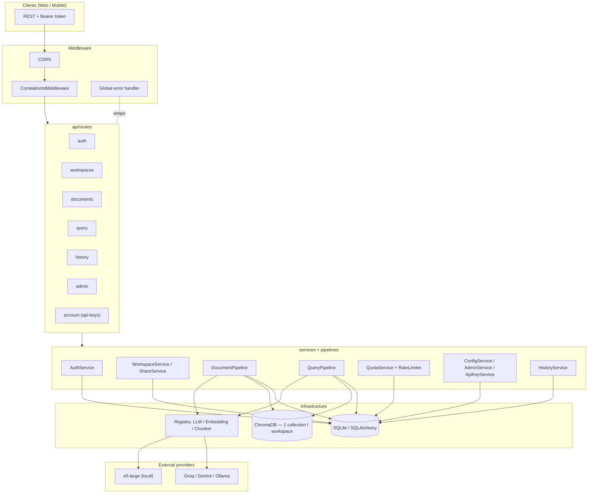
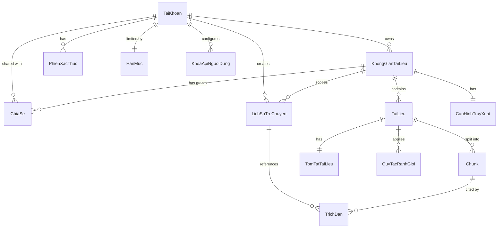
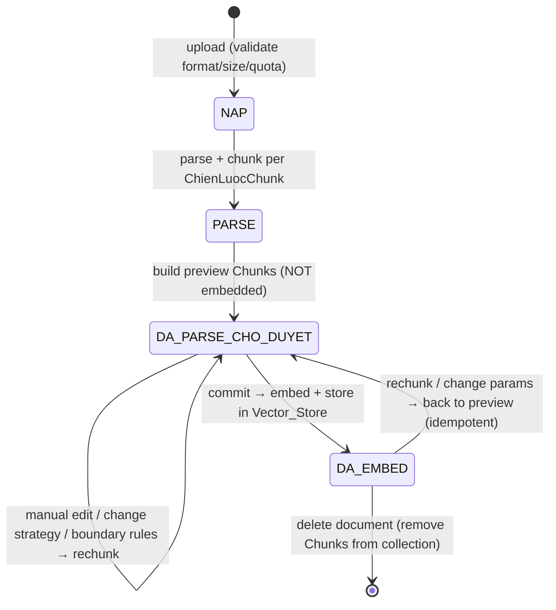

# Backend Documentation — Multi-User RAG Platform

> Design and source-code documentation for the **Backend (BE)**. Covers the
> architecture, data model, main processing flows, and a module-by-module source map.
>
> Vietnamese version: [`backend-design.vi.md`](./backend-design.vi.md).
> Full design (including Web/Mobile): `.kiro/specs/multi-user-rag-platform/design.md`.

## Table of contents

1. [Overview](#1-overview)
2. [Technology stack](#2-technology-stack)
3. [Architecture & layering](#3-architecture--layering)
4. [Data model](#4-data-model)
5. [Authentication & authorization](#5-authentication--authorization)
6. [RAG query flow](#6-rag-query-flow)
7. [Document lifecycle](#7-document-lifecycle)
8. [Chunking: registry & auto-selector](#8-chunking-registry--auto-selector)
9. [Provider registry & BYOK](#9-provider-registry--byok)
10. [Quotas & rate limiting](#10-quotas--rate-limiting)
11. [Logging & error handling](#11-logging--error-handling)
12. [API endpoints](#12-api-endpoints)
13. [Configuration (.env / Settings)](#13-configuration-env--settings)
14. [Source-code map](#14-source-code-map)
15. [Testing](#15-testing)
16. [Running & deployment](#16-running--deployment)

> Naming convention: domain entities/fields are intentionally in Vietnamese
> (no diacritics) — e.g. `taiKhoan` (account), `khongGianTaiLieu` (document
> workspace), `cauHoi` (question), `traLoi` (answer), `trichDan` (citation),
> `mucQuyen` (permission level). Method/verb names are English. This doc keeps the
> real identifiers and glosses them in English where helpful.

---

## 1. Overview

The backend is the **single source of truth** for all business logic, data, and RAG
in the platform. It serves every client (Web, Mobile) over a **REST API** using
Bearer tokens. The system generalizes a Vietnamese-law RAG app into a **multi-user,
multi-domain RAG platform** along four axes:

1. **Real multi-user authentication**: register/login, password hashing (bcrypt),
   temporary login lockout, session revocation, two roles `NGUOI_DUNG` (user) /
   `QUAN_TRI` (admin).
2. **Per-user + per-workspace data isolation**: every document, chunk, history entry,
   and config belongs to a `KhongGianTaiLieu` (document workspace) with an owner;
   vector retrieval is always scoped by permission.
3. **Domain generalization**: multi-strategy chunking via a registry with an "Auto"
   mode; retrieval / prompt / embedding config editable in-app.
4. **Safe, configurable operation**: BYOK key encryption (Fernet), atomic resource
   quotas, rate limiting, configurable timeouts/limits, centralized logging that
   redacts sensitive data.

### Design principles

- **Naming**: entities/fields in Vietnamese-no-diacritics; verbs/methods in English;
  user-facing messages stay in Vietnamese.
- **Self-registering registry**: chunking strategies and LLM/embedding providers use
  `@register_*` + auto-discovery of `*_chunker.py` / `*_provider.py`. Adding a new
  one = create a file + decorator, **no factory/core changes**.
- **Centralized logging**: one `setup_logging()`; every module logs through the
  shared logger, redacts sensitive fields, never swallows errors silently.
- **Strict grounding**: a domain-neutral synthesis prompt that never fabricates;
  `[n]` citations; asynchronous cross-verification; fallback to original chunks on
  LLM failure.

---

## 2. Technology stack

| Component | Choice | Rationale |
|---|---|---|
| Web framework | **FastAPI** + Uvicorn | REST, dependency injection, async, automatic OpenAPI |
| Validation / DTO | **Pydantic v2** + pydantic-settings | request/response DTOs, config from `.env` |
| Relational DB | **SQLite + SQLAlchemy** | Lightweight, no extra infra; switch to Postgres via connection string with no model change |
| Vector DB | **ChromaDB** | 1 collection / workspace → storage-level isolation; per-workspace embedding |
| Embedding | **sentence-transformers** (`intfloat/multilingual-e5-large`, ~2GB, local) | Multilingual, offline; lazy-loaded at embed time |
| LLM | **Groq** (synthesis) / **Gemini** (verification) / **Ollama** | Swap roles via `.env`, no code change |
| PDF parsing | **PyMuPDF** | PDF text extraction |
| Password hashing | **bcrypt** | Industry standard |
| API-key encryption | **cryptography / Fernet** (AES-128) | Symmetric at-rest encryption, deterministic round-trip |
| Testing | **pytest** + **Hypothesis** | Unit + property-based testing (PBT) |

---

## 3. Architecture & layering

The backend is the `app/` package with clear layering: **routes →
services/pipelines → db/storage/providers**. Middleware wraps the outside (CORS,
correlationId, error handler); dependency injection provides the `Session`, the
current user, and workspace access.

### Component diagram



### Directory structure

```
app/
├── main.py                  # FastAPI app, lifespan/DI, CORS, middleware, routers + frontend dist
├── config.py                # Settings (pydantic-settings): defaults + valid ranges; .env anchored absolutely
├── errors.py                # Business exception tree (AppError + httpStatus/errorCode)
├── logging_config.py        # Centralized setup_logging() (console + file)
├── logging_redaction.py     # Sensitive-field redaction util for logging
├── db/
│   ├── database.py          # engine/session factory, init_db(), get_db()
│   └── models.py            # ORM + enums
├── auth/
│   ├── auth_service.py      # register/login/logout/verify/refresh/change/reset/deleteOwnAccount
│   ├── password.py          # hash/verify (bcrypt) + length validation
│   ├── tokens.py            # HMAC token + PhienXacThuc (create/verify/revoke) + reset token
│   └── crypto.py            # encrypt/decrypt API keys (Fernet)
├── api/
│   ├── dependencies.py      # get_db, get_current_user, require_role, require_workspace_access, get_*_pipeline
│   ├── middleware/
│   │   ├── error_handler.py # AppError → HTTP + correlationId + log
│   │   ├── correlation.py   # generate/attach correlationId per request
│   │   └── rate_limit.py    # per-account RateLimiter + rate_limit_query dependency
│   └── routes/
│       ├── auth.py          # /api/auth/* + DELETE /api/account
│       ├── workspaces.py    # /api/workspaces CRUD + shares + retrieval-config
│       ├── documents.py     # upload/list/delete/chunks/commit/rechunk/reset
│       ├── query.py         # POST /api/workspaces/{id}/query
│       ├── history.py       # GET history + DELETE /api/history/{id}
│       ├── admin.py         # /api/admin/* (users/quota/prompts/limits)
│       └── account.py       # /api/account/api-keys (BYOK)
├── services/
│   ├── workspace_service.py # workspace CRUD (transactional delete)
│   ├── share_service.py     # grantShare/revokeShare + resolveAccess
│   ├── quota_service.py     # checkAndReserve (atomic) / releaseQuota / setQuota
│   ├── config_service.py    # retrieval config / prompt template / operational limits
│   ├── admin_service.py     # listAccounts / disableAccount / enableAccount
│   ├── api_key_service.py   # setApiKey/getApiKey/getMaskedKeys/deleteApiKey
│   └── history_service.py   # saveTurn/listHistory/deleteTurn/markStaleCitations
├── pipelines/
│   ├── document_pipeline.py # parse → chunk → preview → (commit) embed → store; idempotent rechunk
│   └── query_pipeline.py    # validate → intent → normalize → hybrid search → gating → synthesis → verify → fallback
├── chunking/
│   ├── registry.py          # @register_chunker + auto-discover *_chunker.py
│   ├── base.py              # ChunkerBase
│   ├── auto_selector.py     # fixed-priority strategy selection
│   ├── recursive_chunker.py / structure_chunker.py / page_chunker.py / semantic_chunker.py
│   └── vietnamese_law_chunker.py  # registered as "vietnamese-law"
├── providers/
│   ├── registry.py          # @register_llm + auto-discover *_provider.py + validate_provider_config
│   ├── llm_provider.py / embedding_provider.py  # Protocol interfaces
│   ├── groq_provider.py / gemini_provider.py / huggingface_embedding.py
├── prompts/
│   └── system_prompts.py    # default templates + INVARIANT_SAFETY_CONSTRAINTS (immutable)
├── models/schemas.py        # Pydantic request/response DTOs
└── storage/vector_store.py  # ChromaDB wrapper: add/search(hybrid BM25+RRF)/delete/get_dieu
```

---

## 4. Data model

### Entity-relationship diagram



### Enums

| Enum | Values (gloss) |
|---|---|
| `VaiTro` (role) | `NGUOI_DUNG` (user), `QUAN_TRI` (admin) |
| `TrangThaiTaiKhoan` (account status) | `HOAT_DONG` (active), `VO_HIEU_HOA` (disabled) |
| `MucQuyen` (permission) | `CHI_DOC` (read-only), `GHI` (write) |
| `TrangThaiTaiLieu` (doc status) | `NAP`, `PARSE`, `DA_PARSE_CHO_DUYET` (parsed, pending review), `DA_EMBED` (embedded) |
| `NhanXacMinh` (verification label) | `đã xác minh` (verified), `có mâu thuẫn` (conflicting), `chưa xác minh` (unverified) |

### Main entities (ORM — `db/models.py`)

| Entity | Responsibility & key fields | Constraints |
|---|---|---|
| `TaiKhoan` (account) | `email`, `tenDangNhap`, `matKhauHash`, `vaiTro`, `trangThai`, `soLanDangNhapThatBai` (failed logins), `khoaDenThoiDiem` (locked until) | `UNIQUE(email)`, `UNIQUE(tenDangNhap)` |
| `PhienXacThuc` (auth session) | jti: `taiKhoanId`, `issuedAt`, `expiresAt`, `revokedAt` | jti = session id = token claim |
| `KhongGianTaiLieu` (workspace) | `ten`, `moTa`, `chuSoHuuId` (owner), `embeddingProvider`, `collectionName` | one collection per workspace |
| `ChiaSe` (share) | `khongGianId`, `taiKhoanId`, `mucQuyen` | `UNIQUE(khongGianId, taiKhoanId)` |
| `TaiLieu` (document) | `tenFile`, `dinhDang` (format), `kichThuoc` (size), `trangThai`, `chienLuocChunk`, `soChunk` | belongs to one workspace |
| `Chunk` | `thuTu` (order), `viTriBatDau/KetThuc` (offsets), `noiDung` (text), `metadata` | preview (RDB) + embedded copy (ChromaDB) |
| `TomTatTaiLieu` (summary) | summary + `outline` for overview mode | 1-1 with document |
| `QuyTacRanhGioi` (boundary rule) | data-driven chunk boundary rules | applied on rechunk |
| `CauHinhTruyXuat` (retrieval config) | thresholds + k + vector/BM25 weights per workspace | defaults 0.3/0.5/k=8/0.5-0.5 |
| `MauPrompt` (prompt template) | per-role template (`synthesis`/`verify`/`normalize`) | immutable safety in code |
| `KhoaApiNguoiDung` (user API key) | `providerTen`, `vaiTro`, `khoaMaHoa` (Fernet ciphertext) | **never stores/logs plaintext** |
| `HanMuc` (quota) | workspaces / storage / documents / frequency | defaults 50 / 5GB / 1000 |
| `LichSuTroChuyen` (chat history) | `cauHoi`, `traLoi`, `nhanXacMinh`, `nguonConKhaDung` (source still available) | per-account |
| `TrichDan` (citation) | `[n]` ↔ chunk: `marker`, `chunkId`, `taiLieuId`, `noiDung` | tied to a history entry |

### Main DTOs (`models/schemas.py`)

`RegisterInput`, `LoginInput`, `ChangePasswordInput`, `ResetPasswordInput`,
`WorkspaceInput`, `ShareInput`, `RetrievalConfigInput`, `DocumentMetadataInput`,
`PreviewResult`, `IndexingResult`, `ChunkEditOp`, `QueryInput{cauHoi, cheDo?}`,
`KetQuaTraLoi{traLoi, trichDan, nhanXacMinh, laFallback, laTongQuan}`,
`KhoaApiInput`, `KhoaApiMasked`, `HanMucInput`, `LimitsInput`, `AccountResponse`,
`HistoryItemResponse`, ...

---

## 5. Authentication & authorization

### HMAC tokens + session revocation

The system uses **time-limited HMAC tokens** plus a `PhienXacThuc` table to support
**revocation**. Token format (ASCII, URL-safe):

```
base64url(payload_json) + "." + base64url(hmac_sha256(secret_key, payload_part))
```

`payload_json` contains `{jti, taiKhoanId, expiresAt}` (`expiresAt` as tz-aware
ISO-8601). The signature is compared in **constant time** (`hmac.compare_digest`) to
prevent timing attacks. Expiry is taken from the signed payload (tamper-proof), not
read back from the DB (SQLite does not preserve timezone info).

`verifyToken` checks in order but **always raises the same generic error**
(`AuthenticationError`) so it never reveals which check failed:

1. Valid HMAC signature.
2. Not expired (`expiresAt > now`).
3. `PhienXacThuc` exists and `revokedAt is None`.
4. Account exists and `trangThai == HOAT_DONG`.

Thanks to the jti, **logout / password change / account disable** only need to set
`revokedAt` and the token loses effect before expiry. `revokeAllSessions(exceptJti=...)`
revokes every session except the current one (used on password change — R25.1).

The **password-reset token** (`createResetToken` / `verifyResetToken`) is
**stateless and single-use**: signed with `secret_key + matKhauHash`. When the
password changes (hash changes), the old token is automatically invalidated — no
token state stored in the DB.

### Central authorization function `resolveAccess`

`resolveAccess(db, taiKhoan, khongGian) -> MucTruyCap ∈ {NONE, CHI_DOC, GHI, CHU_SO_HUU}`
drives all permissions:

- Owner → `CHU_SO_HUU` (full, including share/delete workspace).
- A `ChiaSe` record → returns the granted `mucQuyen` (`CHI_DOC` | `GHI`).
- Otherwise → `NONE`.

**Write** operations (upload, delete document, edit chunks, edit retrieval config)
require `GHI` or higher. Reads/queries require at least `CHI_DOC`. Rename/describe/
delete workspace and share/revoke require `CHU_SO_HUU`.

### Dependency injection (`api/dependencies.py`)

| Dependency | Role |
|---|---|
| `get_db()` | Provide a SQLAlchemy `Session` |
| `get_current_user()` | Extract Bearer token → `verifyToken` → `TaiKhoan`; missing/invalid → 401 |
| `require_role(vaiTro)` | Require the exact role (e.g. `QUAN_TRI`); insufficient → 403 |
| `require_workspace_access(minQuyen)` | Load workspace by path `id`, compute `resolveAccess`, require ≥ `minQuyen` |
| `get_document_pipeline` / `get_query_pipeline` | Build a pipeline on the Session (tests override to inject fakes) |

### Status-code convention (data isolation)

- Missing/invalid token → **401** (`AuthenticationError`).
- No access (`NONE`) to a workspace → **404** (`NotFoundError`): does **not** reveal
  the existence of another user's workspace.
- Workspace is visible but **below** the required permission (needs `GHI`, has only
  `CHI_DOC`) → **403** (`AuthorizationError`).

### Login-abuse protection

- Lockout after **5 failures / 15 minutes** (`login_max_fails` / `login_lock_minutes`).
- Login error messages are **generic and invariant** — never reveal whether an
  email/username exists.
- A `VO_HIEU_HOA` (disabled) account cannot log in and has all sessions revoked.

---

## 6. RAG query flow

`POST /api/workspaces/{id}/query` assembles the flow in the route (per
`query_pipeline.py`):

```mermaid
flowchart TD
    A[POST /workspaces/id/query + token] --> B{Auth + workspace access CHI_DOC}
    B -->|401/403/404| Z[Return matching error]
    B -->|OK| C{Rate limit?}
    C -->|exceeded| Z2[429 — NO LLM call]
    C -->|OK| D[validateQuestion 1..1000]
    D --> E{resolveMode\noverview vs detail\n(deterministic classify / forced mode)}
    E -->|overview| OV[answerOverview\nfrom TomTatTaiLieu + outline\nof permitted documents]
    E -->|detail| F[normalizeQuestion\nadd diacritics, same-word-set guard]
    F --> G[Embed + Hybrid search RRF\nworkspace collection only\nk + weights from CauHinhTruyXuat]
    G --> H{Threshold gating}
    H -->|< nguongKhongTimThay| I['not found' — NO LLM call]
    H -->|< nguongDuLienQuan| J['not relevant enough' — NO LLM call]
    H -->|sufficient| K[answerDetail: synthesize, inline n markers]
    K -->|error/timeout| L[Fallback: original chunks, laFallback=true]
    K -->|OK| M[Return KetQuaTraLoi + TrichDan]
    OV --> M
    M --> N[saveTurn — persist LichSuTroChuyen]
    M --> V[verifyAnswer ASYNC\nlabel: verified / conflicting / unverified]
```

Key invariants:

- **Gating never calls the LLM**: the "not found" / "not relevant enough" branches
  return fixed responses without spending an LLM synthesis call.
- **Per-workspace isolation**: retrieval runs only on the correct workspace's
  collection.
- **Citation bijection**: `[n]` markers lie within `1..N` and map 1-1 to the
  `TrichDan` list.
- **Safe degradation**: verification error/timeout → `unverified`; synthesis
  error/timeout → return original chunks with the `laFallback` flag.
- **Non-blocking history**: a failed `saveTurn` still returns the answer to the user
  (logs a warning only) and never creates a partial entry.

### Hybrid search (RRF)

`VectorStore.search(query_vector, k, query_text=None)`: with `query_text` it runs a
**hybrid** = **vector cosine** + **BM25 keyword**, merged by **RRF (Reciprocal Rank
Fusion)**. Results are ≤ k and correctly ranked. The BM25 tokenizer is custom
(strips diacritics, keeps digits).

---

## 7. Document lifecycle



State lives in `TaiLieu.trangThai`. **Core invariant**: a vector exists in the
Vector_Store **if and only if** `trangThai = DA_EMBED`. Every rechunk **wipes** the
old Chunks of that exact document before writing new ones (**idempotent**); on
mid-operation failure the old Chunks are preserved.

`DocumentPipeline` (key methods): `uploadDocument` (validate write permission,
format, size, storage + document-count quota atomically; 0 chunks → reject; does NOT
embed), `previewChunks`, `editChunks` (merge/split/adjust, reject empty chunks),
`setBoundaryRules`, `commitEmbedding` (commit → embed → store → `DA_EMBED`),
`rechunk` (idempotent), `resetToDefault`, `deleteDocument`, `buildSummary`,
`listDocuments` (paginated).

---

## 8. Chunking: registry & auto-selector

Each strategy extends `ChunkerBase` and self-registers via a decorator:

```python
@register_chunker("recursive" | "structure-aware" | "page" | "semantic" | "vietnamese-law")
class SomeChunker(ChunkerBase):
    def chunk(self, text, thamSo, rules) -> list[Chunk]: ...
```

`registry.py` auto-discovers every `*_chunker.py` — adding a new strategy needs **no
factory change**. Every strategy works on multi-domain documents and produces ≥1
chunk with non-empty text.

**AutoSelector** chooses a strategy by a **fixed priority order** (R17):

```python
PRIORITY = ["vietnamese-law", "structure-aware", "page", "recursive"]
```

1. "Điều" + a digit at the start of a line → `vietnamese-law` (regardless of other
   signals).
2. No (1) but markdown headings present → `structure-aware`.
3. No (1)(2), paginated PDF → `page`.
4. Otherwise → `recursive`.

A configured but non-existent strategy → rejected, naming it (fail-fast).

---

## 9. Provider registry & BYOK

### LLM / Embedding registry

Same pattern as chunkers: each provider self-registers with `@register_llm("name")`
in a `*_provider.py` file; `registry.py` auto-discovers it. `validate_provider_config(settings)`
runs at startup (lifespan): if a configured provider **does not exist** or a
**required role** (synthesis / verification / embedding) is missing, it stops startup
and raises `InitializationError` naming the offender (**fail-fast** — the service
does not start).

Swap the LLM per role via `.env` (`LLM_PRIMARY_PROVIDER`, `LLM_VERIFY_PROVIDER`,
`LLM_NORMALIZE_PROVIDER`, `EMBEDDING_PROVIDER`) — **no code change**. An empty
normalize role reuses the verification provider.

### BYOK (Bring Your Own Key) — `api_key_service.py` + `auth/crypto.py`

- `setApiKey` encrypts the key with **Fernet** before storing (`khoaMaHoa: bytes`) —
  **never** stores/logs plaintext.
- Key resolution at provider-call time: prefer the **user key** → fall back to the
  **system key**; a missing required key → a clear error and **no** provider call.
- Keys are **isolated** per user; any external output is always **masked**
  (`getMaskedKeys`).

---

## 10. Quotas & rate limiting

**QuotaService** (`quota_service.py`): `checkAndReserve` checks and reserves
**atomically** (transactional lock, boundary check) for three resources: number of
workspaces, storage, documents-per-workspace. `releaseQuota` refunds; `setQuota`
(admin only) sets quotas within valid ranges.

**RateLimiter** (`rate_limit.py`): limits **query frequency per `TaiKhoan`** per
minute. The `rate_limit_query` dependency runs **before** any query-route processing:
over the limit → **429**, with **no** LLM call.

---

## 11. Logging & error handling

### Centralized logging

- A single `setup_logging()` (`logging_config.py`): console + file (rotating), UTF-8
  enforced, level by environment (`prod=INFO`, `dev=DEBUG`).
- `CorrelationIdMiddleware` generates/attaches a `correlationId` per request; logs
  INFO method + path + correlationId.
- `logging_redaction.py`: a util that **redacts** sensitive fields (passwords,
  tokens, API keys, PII) when formatting logs. Token/key values are never logged;
  every `catch` logs the error with context — no silent swallowing.

### Business exception tree (`errors.py`)

Every business error extends `AppError` carrying `httpStatus` + `errorCode`; the
global error handler maps it → HTTP, attaches a `correlationId`, logs ERROR with the
stack.

| Exception | HTTP | When |
|---|---|---|
| `ValidationError` | 400 | Bad format/length, out-of-range config |
| `AuthenticationError` | 401 | Missing/invalid/expired/revoked token; disabled account |
| `AuthorizationError` | 403 | Insufficient permission |
| `NotFoundError` | 404 | Workspace/document/account/history entry missing |
| `ConflictError` | 409 | Duplicate email/tenDangNhap |
| `QuotaExceededError` | 409 (may be 429) | Resource quota exceeded |
| `RateLimitError` | 429 | Query frequency exceeded |
| `LockedError` | 423 (may be 429) | Account temporarily locked out from login |
| `InternalError` | 500 | Unexpected error, with correlationId + stack |
| `InitializationError` | 500 | Fail-fast on bad provider/strategy at startup |

---

## 12. API endpoints

| Method & Path | Permission | Description |
|---|---|---|
| `POST /api/auth/register` | public | Register (defaults to `NGUOI_DUNG`) |
| `POST /api/auth/login` | public | → `{token, vaiTro}` |
| `POST /api/auth/logout` | authenticated | Revoke current session |
| `POST /api/auth/refresh` | authenticated | Issue a new token |
| `POST /api/auth/password/change` | authenticated | Change password (revoke other sessions) |
| `POST /api/auth/password/reset-request` | public | Generic response |
| `POST /api/auth/password/reset` | public (reset token) | Reset (single-use + expiring) |
| `DELETE /api/account` | authenticated | Self-delete account |
| `GET/POST /api/workspaces` | authenticated | List (owned + shared) / create |
| `PATCH/DELETE /api/workspaces/{id}` | owner | Rename/describe / delete |
| `POST/DELETE /api/workspaces/{id}/shares` | owner | Grant / revoke share |
| `GET/PUT /api/workspaces/{id}/retrieval-config` | GHI to edit | Retrieval config |
| `POST /api/workspaces/{id}/documents` | GHI | Upload (preview) |
| `GET /api/workspaces/{id}/documents` | CHI_DOC | Paginated list |
| `GET/PUT /api/documents/{id}/chunks` | GHI | Preview / edit chunks |
| `POST /api/documents/{id}/commit` | GHI | Commit embed |
| `POST /api/documents/{id}/rechunk` | GHI | Rechunk |
| `POST /api/documents/{id}/reset` | GHI | Reset to default |
| `DELETE /api/documents/{id}` | GHI | Delete document |
| `POST /api/workspaces/{id}/query` | CHI_DOC | RAG Q&A (rate-limited) |
| `GET /api/workspaces/{id}/history` | CHI_DOC (own) | List history |
| `DELETE /api/history/{id}` | entry owner | Delete history entry |
| `GET /api/admin/users`, `POST .../users/{id}/disable\|enable` | QUAN_TRI | Account management |
| `PUT /api/admin/users/{id}/quota` | QUAN_TRI | Set quota |
| `GET/PUT /api/admin/prompts/{vaiTro}` | QUAN_TRI | Prompt templates |
| `PUT /api/admin/limits` | QUAN_TRI | Operational limits |
| `GET/PUT/DELETE /api/account/api-keys` | authenticated | BYOK |
| `GET /api/health` | public | Health check |

---

## 13. Configuration (.env / Settings)

`config.py` anchors `env_file` **absolutely** to `backend/.env` by file location
(not the cwd) → running from `backend/` or from the repo root both read the same
`.env`. Valid ranges are declared as module constants so `ConfigService` can reuse
them when validating runtime config.

| Key | Default | Valid range |
|---|---|---|
| `environment` | `development` | `prod`=INFO, `dev`=DEBUG |
| `session_ttl_minutes` | 60 | 5 … 1440 |
| `login_max_fails` / `login_lock_minutes` | 5 / 15 | ≥1 |
| `password_reset_ttl_minutes` | 30 | ≥1 |
| `secret_key` | `dev-secret-change-me` | — (signs HMAC tokens) |
| `secret_key_encrypt` | "" | — (Fernet — BYOK) |
| `llm_timeout_seconds` | 30 | 5 … 300 |
| `llm_primary_provider` / `llm_verify_provider` / `llm_normalize_provider` | `groq` / `gemini` / "" | empty normalize = reuse verify |
| `embedding_provider` | `huggingface` | — |
| `max_file_size_mb` | 50 | 1 … 1024 |
| `nguong_khong_tim_thay` / `nguong_du_lien_quan` | 0.3 / 0.5 | [0,1], lower ≤ upper |
| `retrieval_k` | 8 | 1 … 100 |
| `trong_so_vector` / `trong_so_bm25` | 0.5 / 0.5 | [0,1] |
| `quota_so_khong_gian` | 50 | 1 … 1,000 |
| `quota_dung_luong` | 5 GB | 1 MB … 1,024 GB |
| `quota_so_tai_lieu` | 1,000 | 1 … 100,000 |
| `quota_tan_suat_truy_van` | 60 | ≥1 |
| `database_url` | SQLite `data/app.db` | Postgres via connection string |
| `chroma_persist_path` | `data/chroma` | ChromaDB directory |

`get_settings()` returns `Settings` as a **singleton** (used as a dependency).

---

## 14. Source-code map

| File | Responsibility |
|---|---|
| `main.py` | FastAPI app factory, lifespan/DI (`setup_logging` → `init_db` → discover providers/chunkers → `validate_provider_config`), CORS + `CorrelationIdMiddleware` + global error handler, registers 7 routers, serves frontend dist (SPA fallback) |
| `config.py` | `Settings` (pydantic-settings) + valid-range constants; `get_settings()` singleton |
| `errors.py` | `AppError` exception tree (httpStatus + errorCode) |
| `logging_config.py` | Centralized `setup_logging()` (console + file, UTF-8) |
| `logging_redaction.py` | Sensitive-field redaction util |
| `db/database.py` | engine/session factory, `init_db()`, `get_db()` |
| `db/models.py` | ORM + enums |
| `auth/password.py` | `hashPassword`/`verifyPassword` (bcrypt) + 8–64 length validation |
| `auth/tokens.py` | HMAC token + `PhienXacThuc`: `createToken`/`verifyToken`/`revokeToken`/`revokeAllSessions` + stateless single-use reset token |
| `auth/auth_service.py` | register/login (lockout)/logout/refresh/changePassword/reset/deleteOwnAccount |
| `auth/crypto.py` | Fernet encrypt/decrypt for API keys |
| `api/dependencies.py` | `get_db`, `get_current_user`, `require_role`, `require_workspace_access`, `get_*_pipeline` |
| `api/middleware/error_handler.py` | Map `AppError` → HTTP + correlationId + ERROR log |
| `api/middleware/correlation.py` | Generate/attach `correlationId` + request log |
| `api/middleware/rate_limit.py` | Per-account `RateLimiter` + `rate_limit_query` dependency |
| `api/routes/*.py` | Wire HTTP → service/pipeline (wiring only, no business logic) |
| `services/workspace_service.py` | Workspace CRUD (transactional delete, rollback) |
| `services/share_service.py` | `grantShare`/`revokeShare` + `resolveAccess` |
| `services/quota_service.py` | `checkAndReserve` (atomic) / `releaseQuota` / `setQuota` |
| `services/config_service.py` | Retrieval config / prompt templates / operational limits (update/reset) |
| `services/admin_service.py` | `listAccounts` / `disableAccount` (no self-disable) / `enableAccount` |
| `services/api_key_service.py` | BYOK: set/get/getMasked/delete |
| `services/history_service.py` | `saveTurn`/`listHistory`/`deleteTurn`/`markStaleCitations` |
| `pipelines/document_pipeline.py` | Document lifecycle: upload→parse→chunk→preview→commit(embed)→store; idempotent rechunk |
| `pipelines/query_pipeline.py` | RAG flow: validate→intent→normalize→hybrid→gating→synthesize→verify→fallback; overview mode |
| `chunking/*` | `ChunkerBase`, registry, auto-selector, 5 strategies |
| `providers/*` | LLM/embedding registry + interfaces + Groq/Gemini/HuggingFace |
| `prompts/system_prompts.py` | Default templates + `INVARIANT_SAFETY_CONSTRAINTS` (immutable) |
| `models/schemas.py` | Pydantic request/response DTOs |
| `storage/vector_store.py` | ChromaDB wrapper: `add_chunks`/`search` (hybrid BM25+RRF)/`delete`/`get_dieu` |

---

## 15. Testing

- **Frameworks**: `pytest` (unit/integration) + **Hypothesis** (property-based
  testing).
- **PBT convention**: each correctness property is implemented by **exactly one** PBT
  running at least 100 iterations, tagged with
  `# Feature: multi-user-rag-platform, Property {n}: ...`. LLM/embedding providers are
  **mocked** in PBTs.
- **Integration test** (`test_integration_endpoints_flow.py`): assembles the full app
  over an in-memory SQLite + a shared in-memory Vector_Store, runs the E2E flow
  register→login→create workspace→upload→commit→query→history; checks 401/403/404
  data isolation.
- **Run tests** (Windows + Application Control → use `python -m`):

```bat
cd backend
.venv\Scripts\python.exe -m pytest tests/ -q
```

  Current status: **585 tests passing**.

---

## 16. Running & deployment

- **Setup**: `setup.bat` (install deps + create `.env`) → fill in API keys.
- **Run the backend**:

```bat
cd backend
python -m uvicorn app.main:app
```

- **Single-service**: `main.py` also serves `frontend/dist` at `/` (SPA fallback) if
  built; if not built, it skips serving without crashing.
- **Switch DB**: SQLite by default; switch to Postgres via `database_url` with no ORM
  model change.
- **Constraint**: the e5-large embedding model needs ~2GB RAM (Render free 512MB
  won't run it; HF Spaces free 16GB will).

> Admin account and secret keys live in `backend/.env`. Do **not** commit the real
> `.env`; rotate `secret_key` and `secret_key_encrypt` in real environments.
