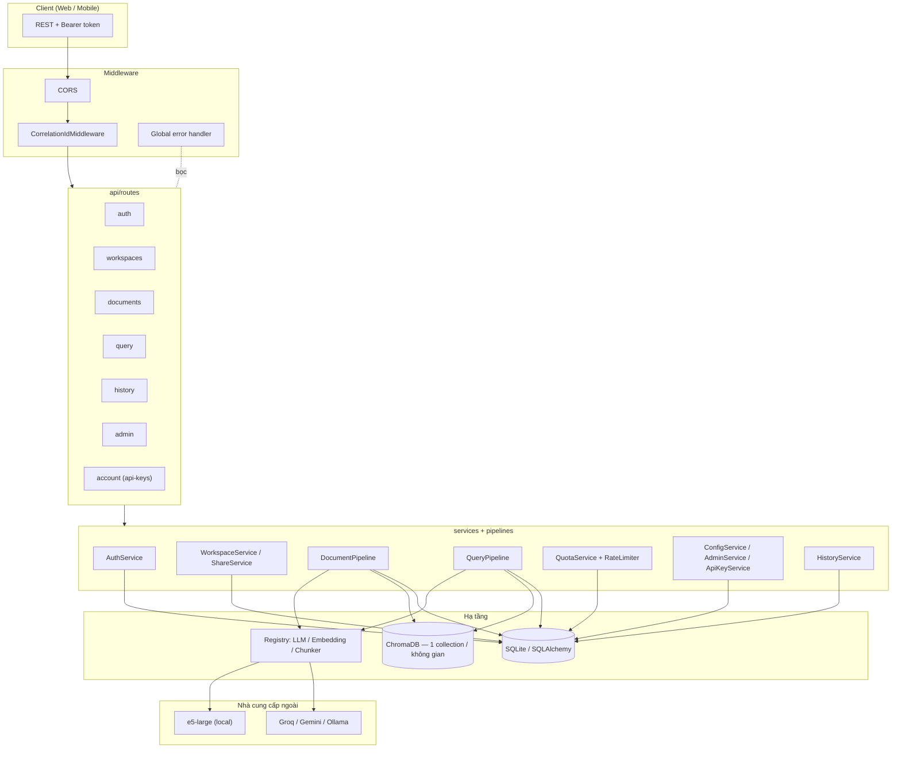
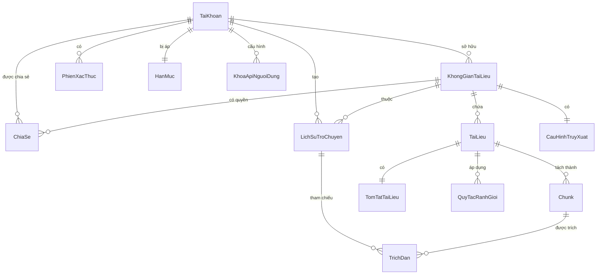
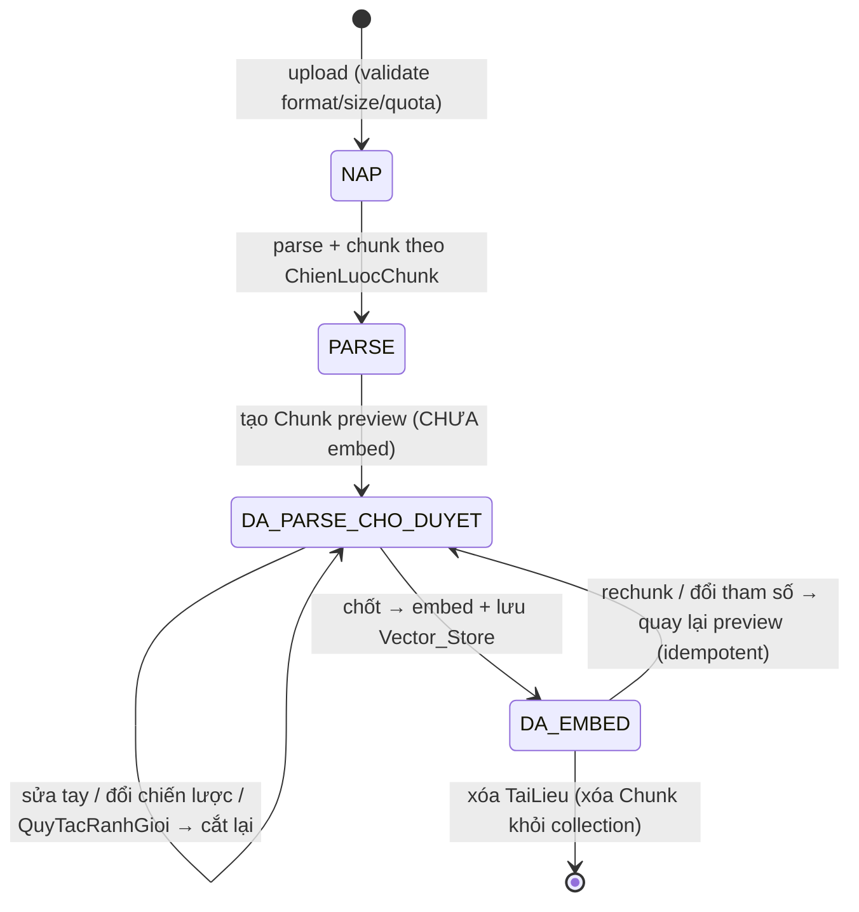

# Tài liệu Backend — Multi-User RAG Platform

> Tài liệu thiết kế và source code cho phần **Backend (BE)**. Mô tả kiến trúc, mô
> hình dữ liệu, các luồng xử lý chính, và bản đồ mã nguồn theo từng module.
>
> Phiên bản tiếng Anh: [`backend-design.en.md`](./backend-design.en.md).
> Thiết kế đầy đủ (gồm cả Web/Mobile): `.kiro/specs/multi-user-rag-platform/design.md`.

## Mục lục

1. [Tổng quan](#1-tổng-quan)
2. [Ngăn xếp công nghệ](#2-ngăn-xếp-công-nghệ)
3. [Kiến trúc & phân tầng](#3-kiến-trúc--phân-tầng)
4. [Mô hình dữ liệu](#4-mô-hình-dữ-liệu)
5. [Xác thực & ủy quyền](#5-xác-thực--ủy-quyền)
6. [Luồng truy vấn RAG](#6-luồng-truy-vấn-rag)
7. [Vòng đời tài liệu](#7-vòng-đời-tài-liệu)
8. [Chunking: registry & auto-selector](#8-chunking-registry--auto-selector)
9. [Provider registry & BYOK](#9-provider-registry--byok)
10. [Hạn mức & giới hạn tần suất](#10-hạn-mức--giới-hạn-tần-suất)
11. [Logging & xử lý lỗi](#11-logging--xử-lý-lỗi)
12. [API endpoints](#12-api-endpoints)
13. [Cấu hình (.env / Settings)](#13-cấu-hình-env--settings)
14. [Bản đồ source code](#14-bản-đồ-source-code)
15. [Kiểm thử](#15-kiểm-thử)
16. [Chạy & triển khai](#16-chạy--triển-khai)

---

## 1. Tổng quan

Backend là **nguồn sự thật duy nhất** cho toàn bộ logic nghiệp vụ, dữ liệu và RAG
của nền tảng. Nó phục vụ mọi client (Web, Mobile) qua **REST API** dùng Bearer
token. Hệ thống tổng quát hóa từ một ứng dụng RAG luật Việt Nam thành một **nền
tảng RAG đa người dùng, đa lĩnh vực** với bốn trục chính:

1. **Đa người dùng có xác thực thật**: đăng ký/đăng nhập, băm mật khẩu (bcrypt),
   khóa đăng nhập tạm thời, thu hồi phiên, hai vai trò `NGUOI_DUNG` / `QUAN_TRI`.
2. **Cô lập dữ liệu theo người dùng + không gian tài liệu**: mọi `TaiLieu`,
   `Chunk`, lịch sử, cấu hình đều thuộc một `KhongGianTaiLieu` có chủ sở hữu; truy
   xuất vector luôn bị giới hạn theo quyền.
3. **Tổng quát hóa khỏi lĩnh vực luật**: chunking đa chiến lược qua registry với
   chế độ "Tự động"; cấu hình truy xuất / prompt / embedding chỉnh được trong app.
4. **Vận hành an toàn, cấu hình được**: BYOK mã hóa khóa (Fernet), hạn mức tài
   nguyên nguyên tử, giới hạn tần suất, timeout/giới hạn cấu hình được, logging tập
   trung che dữ liệu nhạy cảm.

### Nguyên tắc thiết kế

- **Đặt tên**: entity/field tiếng Việt không dấu (`taiKhoan`, `khongGianId`,
  `soChunk`); verb/method tiếng Anh (`createWorkspace`, `verifyToken`); message/label
  hướng người dùng để nguyên tiếng Việt.
- **Registry tự-đăng-ký**: chunking strategy và LLM/embedding provider dùng pattern
  `@register_*` + auto-discover `*_chunker.py` / `*_provider.py`. Thêm provider/chiến
  lược mới = tạo file + decorator, **không sửa factory/core**.
- **Logging tập trung**: một `setup_logging()` duy nhất; mọi module ghi qua logger
  chung, che trường nhạy cảm, không nuốt lỗi im lặng.
- **Strict grounding**: prompt tổng hợp trung lập lĩnh vực, không bịa nội dung;
  trích dẫn `[n]`; xác minh chéo bất đồng bộ; fallback chunk gốc khi LLM lỗi.

---

## 2. Ngăn xếp công nghệ

| Thành phần | Lựa chọn | Lý do |
|---|---|---|
| Web framework | **FastAPI** + Uvicorn | REST, dependency injection, async, OpenAPI tự động |
| Validation / DTO | **Pydantic v2** + pydantic-settings | DTO request/response, đọc cấu hình từ `.env` |
| CSDL quan hệ | **SQLite + SQLAlchemy** | Nhẹ, không thêm hạ tầng; đổi sang Postgres qua connection string không đổi mô hình |
| Vector DB | **ChromaDB** | 1 collection / `KhongGianTaiLieu` → cô lập ở tầng lưu trữ; mỗi không gian có embedding riêng |
| Embedding | **sentence-transformers** (`intfloat/multilingual-e5-large`, ~2GB, local) | Đa ngôn ngữ, chạy offline; nạp lazy lúc embed |
| LLM | **Groq** (tổng hợp) / **Gemini** (xác minh) / **Ollama** | Đổi vai trò qua `.env`, không sửa mã |
| Parse PDF | **PyMuPDF** | Trích xuất văn bản PDF |
| Băm mật khẩu | **bcrypt** | Chuẩn công nghiệp |
| Mã hóa khóa API | **cryptography / Fernet** (AES-128) | Mã hóa-at-rest đối xứng, round-trip xác định |
| Test | **pytest** + **Hypothesis** | Unit + property-based testing (PBT) |

---

## 3. Kiến trúc & phân tầng

Backend là package `app/` chia tầng rõ ràng: **routes → services/pipelines →
db/storage/providers**. Middleware bọc ngoài (CORS, correlationId, error handler);
dependency injection cấp `Session`, người dùng hiện tại và quyền không gian.

### Sơ đồ thành phần



### Cấu trúc thư mục

```
app/
├── main.py                  # FastAPI app, lifespan/DI, CORS, middleware, mount routers + frontend dist
├── config.py                # Settings (pydantic-settings): mặc định + khoảng hợp lệ; neo .env tuyệt đối
├── errors.py                # Cây exception nghiệp vụ (AppError + httpStatus/errorCode)
├── logging_config.py        # setup_logging() tập trung (console + file)
├── logging_redaction.py     # Util che trường nhạy cảm khi log
├── db/
│   ├── database.py          # engine/session factory, init_db(), get_db()
│   └── models.py            # ORM + enums
├── auth/
│   ├── auth_service.py      # register/login/logout/verify/refresh/change/reset/deleteOwnAccount
│   ├── password.py          # hash/verify (bcrypt) + validate độ dài
│   ├── tokens.py            # token HMAC + PhienXacThuc (create/verify/revoke) + reset token
│   └── crypto.py            # encrypt/decrypt khóa API (Fernet)
├── api/
│   ├── dependencies.py      # get_db, get_current_user, require_role, require_workspace_access, get_*_pipeline
│   ├── middleware/
│   │   ├── error_handler.py # ánh xạ AppError → HTTP + correlationId + log
│   │   ├── correlation.py   # sinh/đính correlationId cho mỗi request
│   │   └── rate_limit.py    # RateLimiter theo TaiKhoan + dependency rate_limit_query
│   └── routes/
│       ├── auth.py          # /api/auth/* + DELETE /api/account
│       ├── workspaces.py    # /api/workspaces CRUD + shares + retrieval-config
│       ├── documents.py     # upload/list/delete/chunks/commit/rechunk/reset
│       ├── query.py         # POST /api/workspaces/{id}/query
│       ├── history.py       # GET history + DELETE /api/history/{id}
│       ├── admin.py         # /api/admin/* (users/quota/prompts/limits)
│       └── account.py       # /api/account/api-keys (BYOK)
├── services/
│   ├── workspace_service.py # CRUD không gian (xóa có giao dịch)
│   ├── share_service.py     # grantShare/revokeShare + resolveAccess
│   ├── quota_service.py     # checkAndReserve (atomic) / releaseQuota / setQuota
│   ├── config_service.py    # cấu hình truy xuất / prompt template / giới hạn vận hành
│   ├── admin_service.py     # listAccounts / disableAccount / enableAccount
│   ├── api_key_service.py   # setApiKey/getApiKey/getMaskedKeys/deleteApiKey
│   └── history_service.py   # saveTurn/listHistory/deleteTurn/markStaleCitations
├── pipelines/
│   ├── document_pipeline.py # parse → chunk → preview → (chốt) embed → store; rechunk idempotent
│   └── query_pipeline.py    # validate → intent → normalize → hybrid search → gating → synthesis → verify → fallback
├── chunking/
│   ├── registry.py          # @register_chunker + auto-discover *_chunker.py
│   ├── base.py              # ChunkerBase
│   ├── auto_selector.py     # chọn chiến lược theo thứ tự ưu tiên cố định
│   ├── recursive_chunker.py / structure_chunker.py / page_chunker.py / semantic_chunker.py
│   └── vietnamese_law_chunker.py  # đăng ký tên "vietnamese-law"
├── providers/
│   ├── registry.py          # @register_llm + auto-discover *_provider.py + validate_provider_config
│   ├── llm_provider.py / embedding_provider.py  # interface (Protocol)
│   ├── groq_provider.py / gemini_provider.py / huggingface_embedding.py
├── prompts/
│   └── system_prompts.py    # template mặc định + INVARIANT_SAFETY_CONSTRAINTS (bất biến)
├── models/schemas.py        # Pydantic DTO request/response
└── storage/vector_store.py  # Wrapper ChromaDB: add/search(hybrid BM25+RRF)/delete/get_dieu
```

---

## 4. Mô hình dữ liệu

### Sơ đồ quan hệ



### Enums

| Enum | Giá trị |
|---|---|
| `VaiTro` | `NGUOI_DUNG`, `QUAN_TRI` |
| `TrangThaiTaiKhoan` | `HOAT_DONG`, `VO_HIEU_HOA` |
| `MucQuyen` | `CHI_DOC`, `GHI` |
| `TrangThaiTaiLieu` | `NAP`, `PARSE`, `DA_PARSE_CHO_DUYET`, `DA_EMBED` |
| `NhanXacMinh` | `đã xác minh`, `có mâu thuẫn`, `chưa xác minh` |

### Thực thể chính (ORM — `db/models.py`)

| Thực thể | Trách nhiệm & trường tiêu biểu | Ràng buộc |
|---|---|---|
| `TaiKhoan` | Tài khoản: `email`, `tenDangNhap`, `matKhauHash`, `vaiTro`, `trangThai`, `soLanDangNhapThatBai`, `khoaDenThoiDiem` | `UNIQUE(email)`, `UNIQUE(tenDangNhap)` |
| `PhienXacThuc` | Phiên (jti): `taiKhoanId`, `issuedAt`, `expiresAt`, `revokedAt` | jti = id phiên = claim trong token |
| `KhongGianTaiLieu` | Không gian: `ten`, `moTa`, `chuSoHuuId`, `embeddingProvider`, `collectionName` | mỗi không gian 1 collection |
| `ChiaSe` | Chia sẻ quyền: `khongGianId`, `taiKhoanId`, `mucQuyen` | `UNIQUE(khongGianId, taiKhoanId)` |
| `TaiLieu` | Tài liệu: `tenFile`, `dinhDang`, `kichThuoc`, `trangThai`, `chienLuocChunk`, `soChunk` | thuộc 1 không gian |
| `Chunk` | Mảnh văn bản: `thuTu`, `viTriBatDau/KetThuc`, `noiDung`, `metadata` | preview (RDB) + bản embed (ChromaDB) |
| `TomTatTaiLieu` | Tóm tắt + `outline` phục vụ chế độ tổng quan | 1-1 với TaiLieu |
| `QuyTacRanhGioi` | Quy tắc ranh giới chunk (lưu dạng dữ liệu) | áp khi cắt lại |
| `CauHinhTruyXuat` | Ngưỡng + k + trọng số vector/BM25 theo không gian | mặc định 0.3/0.5/k=8/0.5-0.5 |
| `MauPrompt` | Template prompt theo vai trò (`synthesis`/`verify`/`normalize`) | safety bất biến nằm trong mã |
| `KhoaApiNguoiDung` | Khóa BYOK: `providerTen`, `vaiTro`, `khoaMaHoa` (Fernet ciphertext) | **không bao giờ lưu/log plaintext** |
| `HanMuc` | Hạn mức: số không gian / dung lượng / số tài liệu / tần suất | mặc định 50 / 5GB / 1000 |
| `LichSuTroChuyen` | Lịch sử: `cauHoi`, `traLoi`, `nhanXacMinh`, `nguonConKhaDung` | của riêng từng tài khoản |
| `TrichDan` | Trích dẫn `[n]` ↔ chunk: `marker`, `chunkId`, `taiLieuId`, `noiDung` | gắn với một mục lịch sử |

### DTO chính (`models/schemas.py`)

`RegisterInput`, `LoginInput`, `ChangePasswordInput`, `ResetPasswordInput`,
`WorkspaceInput`, `ShareInput`, `RetrievalConfigInput`, `DocumentMetadataInput`,
`PreviewResult`, `IndexingResult`, `ChunkEditOp`, `QueryInput{cauHoi, cheDo?}`,
`KetQuaTraLoi{traLoi, trichDan, nhanXacMinh, laFallback, laTongQuan}`,
`KhoaApiInput`, `KhoaApiMasked`, `HanMucInput`, `LimitsInput`, `AccountResponse`,
`HistoryItemResponse`, ...

---

## 5. Xác thực & ủy quyền

### Token HMAC + thu hồi phiên

Hệ thống dùng **token HMAC có hạn** kèm bảng `PhienXacThuc` để hỗ trợ **thu hồi**.
Định dạng token (chuỗi ASCII, URL-safe):

```
base64url(payload_json) + "." + base64url(hmac_sha256(secret_key, payload_part))
```

`payload_json` chứa `{jti, taiKhoanId, expiresAt}` (`expiresAt` ISO-8601 tz-aware).
Chữ ký được so sánh **constant-time** (`hmac.compare_digest`) chống timing attack.
Hạn token lấy từ payload đã ký (chống giả mạo), không đọc lại từ DB (SQLite không
giữ thông tin timezone).

`verifyToken` kiểm tra theo thứ tự nhưng **luôn ném cùng một lỗi chung**
(`AuthenticationError`) để không lộ bước nào sai:

1. Chữ ký HMAC hợp lệ.
2. Token chưa hết hạn (`expiresAt > now`).
3. `PhienXacThuc` tồn tại và `revokedAt is None` (chưa thu hồi).
4. Tài khoản tồn tại và `trangThai == HOAT_DONG`.

Nhờ jti, các thao tác **logout / đổi mật khẩu / vô hiệu hóa tài khoản** chỉ cần đặt
`revokedAt` là token mất hiệu lực dù chưa hết hạn. `revokeAllSessions(exceptJti=...)`
thu hồi mọi phiên trừ phiên hiện tại (dùng khi đổi mật khẩu — R25.1).

**Token đặt lại mật khẩu** (`createResetToken`/`verifyResetToken`) là **stateless,
single-use**: ký bằng `secret_key + matKhauHash`. Khi mật khẩu đổi (hash đổi), token
cũ tự động vô hiệu — không cần lưu trạng thái token trong DB.

### Hàm ủy quyền trung tâm `resolveAccess`

`resolveAccess(db, taiKhoan, khongGian) -> MucTruyCap ∈ {NONE, CHI_DOC, GHI, CHU_SO_HUU}`
quyết định mọi quyền:

- Chủ sở hữu → `CHU_SO_HUU` (đầy đủ, gồm chia sẻ/xóa không gian).
- Có bản ghi `ChiaSe` → trả `mucQuyen` tương ứng (`CHI_DOC` | `GHI`).
- Ngược lại → `NONE`.

Thao tác **ghi** (upload, xóa tài liệu, sửa chunk, chỉnh cấu hình truy xuất) yêu cầu
`GHI` trở lên. Đọc/truy vấn yêu cầu tối thiểu `CHI_DOC`. Đổi tên/mô tả/xóa không gian
và chia sẻ/thu hồi chỉ `CHU_SO_HUU`.

### Dependency injection (`api/dependencies.py`)

| Dependency | Vai trò |
|---|---|
| `get_db()` | Cấp `Session` SQLAlchemy |
| `get_current_user()` | Trích Bearer token → `verifyToken` → `TaiKhoan`; thiếu/sai → 401 |
| `require_role(vaiTro)` | Yêu cầu đúng vai trò (vd `QUAN_TRI`); không đủ → 403 |
| `require_workspace_access(minQuyen)` | Nạp không gian theo path `id`, tính `resolveAccess`, yêu cầu ≥ `minQuyen` |
| `get_document_pipeline` / `get_query_pipeline` | Dựng pipeline trên Session (test override để bơm fake) |

### Quy ước mã trạng thái (cô lập dữ liệu)

- Thiếu/sai token → **401** (`AuthenticationError`).
- Không có quyền (`NONE`) với không gian → **404** (`NotFoundError`): **không lộ**
  sự tồn tại không gian của người khác.
- Thấy được không gian nhưng **dưới** mức yêu cầu (cần `GHI` mà chỉ `CHI_DOC`) →
  **403** (`AuthorizationError`).

### Chống lạm dụng đăng nhập

- Khóa sau **5 lần thất bại / 15 phút** (`login_max_fails` / `login_lock_minutes`).
- Thông báo lỗi đăng nhập **chung chung, bất biến** — không lộ email/tên có tồn tại.
- Tài khoản `VO_HIEU_HOA` không đăng nhập được và bị thu hồi mọi phiên.

---

## 6. Luồng truy vấn RAG

`POST /api/workspaces/{id}/query` lắp ráp luồng trong route (theo `query_pipeline.py`):

```mermaid
flowchart TD
    A[POST /workspaces/id/query + token] --> B{Xác thực + quyền không gian CHI_DOC}
    B -->|401/403/404| Z[Trả lỗi tương ứng]
    B -->|OK| C{Rate limit?}
    C -->|vượt| Z2[429 — KHÔNG gọi LLM]
    C -->|OK| D[validateQuestion 1..1000]
    D --> E{resolveMode\ntổng quan vs chi tiết\n(phân loại xác định / ép chế độ)}
    E -->|tổng quan| OV[answerOverview\ntừ TomTatTaiLieu + outline\ncác TaiLieu có quyền]
    E -->|chi tiết| F[normalizeQuestion\nthêm dấu, guard cùng bộ từ]
    F --> G[Embed + Hybrid search RRF\nchỉ collection của không gian\nk + trọng số từ CauHinhTruyXuat]
    G --> H{Gating ngưỡng}
    H -->|< nguongKhongTimThay| I[Trả 'không tìm thấy' — KHÔNG gọi LLM]
    H -->|< nguongDuLienQuan| J[Trả 'chưa đủ liên quan' — KHÔNG gọi LLM]
    H -->|đủ| K[answerDetail: synthesize, chèn n inline]
    K -->|lỗi/timeout| L[Fallback: trả chunk gốc, laFallback=true]
    K -->|OK| M[Trả KetQuaTraLoi + TrichDan]
    OV --> M
    M --> N[saveTurn — lưu LichSuTroChuyen]
    M --> V[verifyAnswer BẤT ĐỒNG BỘ\nnhãn: đã xác minh / có mâu thuẫn / chưa xác minh]
```

Các bất biến quan trọng:

- **Gating không gọi LLM**: hai nhánh "không tìm thấy" / "chưa đủ liên quan" trả
  phản hồi cố định, **không** tốn lượt LLM tổng hợp.
- **Cô lập theo không gian**: truy xuất chỉ trên collection của đúng không gian.
- **Trích dẫn song ánh**: marker `[n]` nằm trong `1..N` và ánh xạ 1-1 với danh sách
  `TrichDan`.
- **Suy biến an toàn**: lỗi/timeout xác minh → `chưa xác minh`; lỗi/timeout tổng hợp
  → trả chunk gốc kèm cờ `laFallback`.
- **Lưu lịch sử không chặn**: `saveTurn` lỗi vẫn trả câu trả lời cho người dùng (chỉ
  log cảnh báo), không tạo mục dở.

### Hybrid search (RRF)

`VectorStore.search(query_vector, k, query_text=None)`: khi có `query_text` thực
hiện **hybrid** = kết hợp **vector cosine** + **BM25 từ khóa**, hợp nhất bằng **RRF
(Reciprocal Rank Fusion)**. Số kết quả ≤ k và đúng thứ tự xếp hạng. Tokenizer BM25
tự viết, bỏ dấu/giữ số.

---

## 7. Vòng đời tài liệu



Trạng thái giữ trong `TaiLieu.trangThai`. **Bất biến cốt lõi**: vector chỉ tồn tại
trong Vector_Store **khi và chỉ khi** `trangThai = DA_EMBED`. Mọi thao tác cắt lại
**xóa sạch** Chunk cũ của đúng TaiLieu đó trước khi ghi Chunk mới (**idempotent**);
nếu lỗi giữa chừng → giữ nguyên Chunk cũ.

`DocumentPipeline` (các method tiêu biểu): `uploadDocument` (validate quyền GHI,
định dạng, kích thước, quota dung lượng + số tài liệu atomic; 0 chunk → từ chối;
KHÔNG embed), `previewChunks`, `editChunks` (merge/split/adjust, từ chối Chunk rỗng),
`setBoundaryRules`, `commitEmbedding` (chốt → embed → lưu collection → `DA_EMBED`),
`rechunk` (idempotent), `resetToDefault`, `deleteDocument`, `buildSummary`,
`listDocuments` (phân trang).

---

## 8. Chunking: registry & auto-selector

Mỗi chiến lược kế thừa `ChunkerBase` và tự đăng ký qua decorator:

```python
@register_chunker("recursive" | "structure-aware" | "page" | "semantic" | "vietnamese-law")
class SomeChunker(ChunkerBase):
    def chunk(self, text, thamSo, rules) -> list[Chunk]: ...
```

`registry.py` auto-discover mọi `*_chunker.py` — thêm chiến lược mới **không sửa
factory**. Mọi chiến lược áp dụng cho tài liệu đa lĩnh vực và tạo ≥1 Chunk với văn
bản không rỗng.

**AutoSelector** chọn chiến lược theo **thứ tự ưu tiên cố định** (R17):

```python
PRIORITY = ["vietnamese-law", "structure-aware", "page", "recursive"]
```

1. Có "Điều" + chữ số đầu dòng → `vietnamese-law` (bất kể dấu hiệu khác).
2. Không (1) nhưng có heading markdown → `structure-aware`.
3. Không (1)(2), là PDF phân trang → `page`.
4. Còn lại → `recursive`.

Chiến lược được cấu hình không tồn tại → từ chối, nêu rõ tên (fail-fast).

---

## 9. Provider registry & BYOK

### Registry LLM / Embedding

Theo đúng pattern chunker: mỗi provider tự đăng ký bằng `@register_llm("ten")` trong
file `*_provider.py`; `registry.py` auto-discover. `validate_provider_config(settings)`
chạy lúc khởi tạo (lifespan): phát hiện provider được cấu hình **không tồn tại** hoặc
**thiếu vai trò bắt buộc** (tổng hợp / xác minh / embedding) → dừng khởi tạo và phát
`InitializationError` nêu rõ tên (**fail-fast**, không khởi động dịch vụ).

Đổi LLM theo vai trò qua `.env` (`LLM_PRIMARY_PROVIDER`, `LLM_VERIFY_PROVIDER`,
`LLM_NORMALIZE_PROVIDER`, `EMBEDDING_PROVIDER`) — **không sửa mã**. Vai trò
normalize để trống → dùng chung provider xác minh.

### BYOK (Bring Your Own Key) — `api_key_service.py` + `auth/crypto.py`

- `setApiKey` mã hóa khóa bằng **Fernet** trước khi lưu (`khoaMaHoa: bytes`) — **không
  bao giờ** lưu/ghi/log plaintext.
- Phân giải khóa khi gọi provider: ưu tiên **khóa người dùng** → dự phòng **khóa hệ
  thống**; thiếu khóa bắt buộc → lỗi rõ ràng, **không** gọi provider.
- Khóa **cô lập** giữa người dùng; xuất ra ngoài luôn ở dạng **masked**
  (`getMaskedKeys`).

---

## 10. Hạn mức & giới hạn tần suất

**QuotaService** (`quota_service.py`): `checkAndReserve` kiểm tra + đặt chỗ **nguyên
tử** (khóa giao dịch, kiểm tại biên) cho ba loại: số không gian, dung lượng, số tài
liệu/không gian. `releaseQuota` hoàn trả; `setQuota` (chỉ `QUAN_TRI`) đặt hạn mức
trong khoảng hợp lệ.

**RateLimiter** (`rate_limit.py`): giới hạn **tần suất truy vấn theo `TaiKhoan`**
mỗi phút. Dependency `rate_limit_query` chạy **trước** mọi xử lý của route query: vượt
hạn → **429**, **không** gọi LLM.

---

## 11. Logging & xử lý lỗi

### Logging tập trung

- Một `setup_logging()` duy nhất (`logging_config.py`): console + file (rotate),
  ép UTF-8, level theo môi trường (`prod=INFO`, `dev=DEBUG`).
- `CorrelationIdMiddleware` sinh/đính `correlationId` cho mỗi request; log INFO
  method + path + correlationId.
- `logging_redaction.py`: util **che** trường nhạy cảm (mật khẩu, token, khóa API,
  PII) khi format log. Không log giá trị token/khóa; mọi `catch` log lỗi kèm context,
  không nuốt lỗi im lặng.

### Cây exception nghiệp vụ (`errors.py`)

Mọi lỗi nghiệp vụ kế thừa `AppError` mang `httpStatus` + `errorCode`; global error
handler ánh xạ → HTTP, gắn `correlationId`, log ERROR kèm stack.

| Exception | HTTP | Khi nào |
|---|---|---|
| `ValidationError` | 400 | Sai định dạng/độ dài, cấu hình ngoài khoảng |
| `AuthenticationError` | 401 | Token thiếu/sai/hết hạn/thu hồi; tài khoản vô hiệu |
| `AuthorizationError` | 403 | Không đủ quyền |
| `NotFoundError` | 404 | Không gian/tài liệu/tài khoản/mục lịch sử không tồn tại |
| `ConflictError` | 409 | Trùng email/tenDangNhap |
| `QuotaExceededError` | 409 (có thể 429) | Vượt hạn mức tài nguyên |
| `RateLimitError` | 429 | Vượt tần suất truy vấn |
| `LockedError` | 423 (có thể 429) | Tài khoản đang bị khóa đăng nhập |
| `InternalError` | 500 | Lỗi không lường, kèm correlationId + stack |
| `InitializationError` | 500 | Fail-fast khi provider/chiến lược sai lúc khởi tạo |

---

## 12. API endpoints

| Method & Path | Quyền | Mô tả |
|---|---|---|
| `POST /api/auth/register` | công khai | Đăng ký (mặc định `NGUOI_DUNG`) |
| `POST /api/auth/login` | công khai | → `{token, vaiTro}` |
| `POST /api/auth/logout` | đã xác thực | Thu hồi phiên hiện tại |
| `POST /api/auth/refresh` | đã xác thực | Cấp token mới |
| `POST /api/auth/password/change` | đã xác thực | Đổi mật khẩu (thu hồi phiên khác) |
| `POST /api/auth/password/reset-request` | công khai | Phản hồi chung chung |
| `POST /api/auth/password/reset` | công khai (token reset) | Đặt lại (single-use + hết hạn) |
| `DELETE /api/account` | đã xác thực | Tự xóa tài khoản |
| `GET/POST /api/workspaces` | đã xác thực | Liệt kê (sở hữu + chia sẻ) / tạo |
| `PATCH/DELETE /api/workspaces/{id}` | chủ sở hữu | Đổi tên/mô tả / xóa |
| `POST/DELETE /api/workspaces/{id}/shares` | chủ sở hữu | Cấp / thu hồi chia sẻ |
| `GET/PUT /api/workspaces/{id}/retrieval-config` | GHI để sửa | Cấu hình truy xuất |
| `POST /api/workspaces/{id}/documents` | GHI | Upload (preview) |
| `GET /api/workspaces/{id}/documents` | CHI_DOC | Phân trang |
| `GET/PUT /api/documents/{id}/chunks` | GHI | Preview / sửa chunk |
| `POST /api/documents/{id}/commit` | GHI | Chốt embed |
| `POST /api/documents/{id}/rechunk` | GHI | Cắt lại |
| `POST /api/documents/{id}/reset` | GHI | Reset mặc định |
| `DELETE /api/documents/{id}` | GHI | Xóa tài liệu |
| `POST /api/workspaces/{id}/query` | CHI_DOC | Hỏi đáp RAG (gắn rate limit) |
| `GET /api/workspaces/{id}/history` | CHI_DOC (của chính mình) | Liệt kê lịch sử |
| `DELETE /api/history/{id}` | chủ mục | Xóa mục lịch sử |
| `GET /api/admin/users`, `POST .../users/{id}/disable\|enable` | QUAN_TRI | Quản lý tài khoản |
| `PUT /api/admin/users/{id}/quota` | QUAN_TRI | Đặt hạn mức |
| `GET/PUT /api/admin/prompts/{vaiTro}` | QUAN_TRI | Mẫu prompt |
| `PUT /api/admin/limits` | QUAN_TRI | Giới hạn vận hành |
| `GET/PUT/DELETE /api/account/api-keys` | đã xác thực | BYOK |
| `GET /api/health` | công khai | Kiểm tra sức khỏe |

---

## 13. Cấu hình (.env / Settings)

`config.py` neo `env_file` **tuyệt đối** vào `backend/.env` theo vị trí file (không
theo cwd) → chạy từ `backend/` hay từ gốc đều đọc đúng cùng `.env`. Khoảng hợp lệ
khai báo là hằng số module để `ConfigService` tái dùng khi validate runtime.

| Khóa | Mặc định | Khoảng hợp lệ |
|---|---|---|
| `environment` | `development` | `prod`=INFO, `dev`=DEBUG |
| `session_ttl_minutes` | 60 | 5 … 1440 |
| `login_max_fails` / `login_lock_minutes` | 5 / 15 | ≥1 |
| `password_reset_ttl_minutes` | 30 | ≥1 |
| `secret_key` | `dev-secret-change-me` | — (ký token HMAC) |
| `secret_key_encrypt` | "" | — (Fernet — BYOK) |
| `llm_timeout_seconds` | 30 | 5 … 300 |
| `llm_primary_provider` / `llm_verify_provider` / `llm_normalize_provider` | `groq` / `gemini` / "" | normalize trống = dùng verify |
| `embedding_provider` | `huggingface` | — |
| `max_file_size_mb` | 50 | 1 … 1024 |
| `nguong_khong_tim_thay` / `nguong_du_lien_quan` | 0.3 / 0.5 | [0,1], dưới ≤ trên |
| `retrieval_k` | 8 | 1 … 100 |
| `trong_so_vector` / `trong_so_bm25` | 0.5 / 0.5 | [0,1] |
| `quota_so_khong_gian` | 50 | 1 … 1.000 |
| `quota_dung_luong` | 5 GB | 1 MB … 1.024 GB |
| `quota_so_tai_lieu` | 1.000 | 1 … 100.000 |
| `quota_tan_suat_truy_van` | 60 | ≥1 |
| `database_url` | SQLite `data/app.db` | đổi Postgres qua connection string |
| `chroma_persist_path` | `data/chroma` | thư mục ChromaDB |

`get_settings()` trả `Settings` dạng **singleton** (dùng làm dependency).

---

## 14. Bản đồ source code

| File | Trách nhiệm |
|---|---|
| `main.py` | Tạo FastAPI app (factory), lifespan/DI (`setup_logging` → `init_db` → discover providers/chunkers → `validate_provider_config`), CORS + `CorrelationIdMiddleware` + global error handler, đăng ký 7 router, phục vụ frontend dist (SPA fallback) |
| `config.py` | `Settings` (pydantic-settings) + hằng số khoảng hợp lệ; `get_settings()` singleton |
| `errors.py` | Cây exception `AppError` (httpStatus + errorCode) |
| `logging_config.py` | `setup_logging()` tập trung (console + file, UTF-8) |
| `logging_redaction.py` | Util che trường nhạy cảm khi log |
| `db/database.py` | engine/session factory, `init_db()`, `get_db()` |
| `db/models.py` | ORM + enums |
| `auth/password.py` | `hashPassword`/`verifyPassword` (bcrypt) + validate độ dài 8–64 |
| `auth/tokens.py` | Token HMAC + `PhienXacThuc`: `createToken`/`verifyToken`/`revokeToken`/`revokeAllSessions` + reset token stateless single-use |
| `auth/auth_service.py` | register/login (lockout)/logout/refresh/changePassword/reset/deleteOwnAccount |
| `auth/crypto.py` | encrypt/decrypt Fernet cho khóa API |
| `api/dependencies.py` | `get_db`, `get_current_user`, `require_role`, `require_workspace_access`, `get_*_pipeline` |
| `api/middleware/error_handler.py` | Ánh xạ `AppError` → HTTP + correlationId + log ERROR |
| `api/middleware/correlation.py` | Sinh/đính `correlationId` + log request |
| `api/middleware/rate_limit.py` | `RateLimiter` theo TaiKhoan + dependency `rate_limit_query` |
| `api/routes/*.py` | Lắp ráp HTTP → service/pipeline (chỉ wiring, không chứa business logic) |
| `services/workspace_service.py` | CRUD không gian (xóa có giao dịch, rollback) |
| `services/share_service.py` | `grantShare`/`revokeShare` + `resolveAccess` |
| `services/quota_service.py` | `checkAndReserve` (atomic) / `releaseQuota` / `setQuota` |
| `services/config_service.py` | Cấu hình truy xuất / mẫu prompt / giới hạn vận hành (update/reset) |
| `services/admin_service.py` | `listAccounts` / `disableAccount` (không tự vô hiệu) / `enableAccount` |
| `services/api_key_service.py` | BYOK: set/get/getMasked/delete |
| `services/history_service.py` | `saveTurn`/`listHistory`/`deleteTurn`/`markStaleCitations` |
| `pipelines/document_pipeline.py` | Vòng đời tài liệu: upload→parse→chunk→preview→commit(embed)→store; rechunk idempotent |
| `pipelines/query_pipeline.py` | Luồng RAG: validate→intent→normalize→hybrid→gating→synthesize→verify→fallback; chế độ tổng quan |
| `chunking/*` | `ChunkerBase`, registry, auto-selector, 5 chiến lược |
| `providers/*` | Registry LLM/embedding + interface + Groq/Gemini/HuggingFace |
| `prompts/system_prompts.py` | Template mặc định + `INVARIANT_SAFETY_CONSTRAINTS` (bất biến) |
| `models/schemas.py` | DTO Pydantic request/response |
| `storage/vector_store.py` | Wrapper ChromaDB: `add_chunks`/`search` (hybrid BM25+RRF)/`delete`/`get_dieu` |

---

## 15. Kiểm thử

- **Khung**: `pytest` (unit/integration) + **Hypothesis** (property-based testing).
- **Quy ước PBT**: mỗi correctness property hiện thực bằng **đúng một** PBT chạy tối
  thiểu 100 vòng, gắn comment `# Feature: multi-user-rag-platform, Property {n}: ...`.
  LLM/Embedding provider được **mock** trong PBT.
- **Integration test** (`test_integration_endpoints_flow.py`): lắp ráp app đầy đủ
  trên SQLite in-memory + Vector_Store in-memory dùng chung, chạy luồng E2E
  đăng ký→đăng nhập→tạo không gian→upload→commit→query→history; kiểm 401/403/404 cô
  lập dữ liệu.
- **Chạy test** (Windows + Application Control → dùng `python -m`):

```bat
cd backend
.venv\Scripts\python.exe -m pytest tests/ -q
```

  Hiện trạng: **585 test pass**.

---

## 16. Chạy & triển khai

- **Cài đặt**: `setup.bat` (cài deps + tạo `.env`) → điền API key.
- **Chạy backend**:

```bat
cd backend
python -m uvicorn app.main:app
```

- **Single-service**: `main.py` phục vụ luôn `frontend/dist` tại `/` (SPA fallback)
  nếu đã build; chưa build → bỏ qua, không crash.
- **Đổi CSDL**: SQLite mặc định; đổi sang Postgres qua `database_url` mà không đổi
  mô hình ORM.
- **Ràng buộc**: model embedding e5-large ~2GB RAM (Render free 512MB không chạy;
  HF Spaces free 16GB chạy được).

> Tài khoản admin và secret key đặt trong `backend/.env`. **Không** commit `.env`
> thật; đổi `secret_key` và `secret_key_encrypt` ở môi trường thật.
